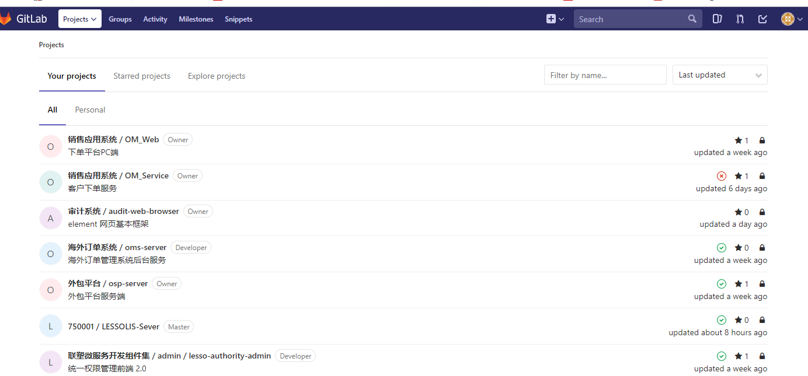

# 开发前准备

## 开发工具

1.  开发工具可以使用eclipse或者idea，两个软件都可在官网下载。

2.  数据库使用mysql-5.7的版本，图形化工具推荐使用navicat。

3.  jdk使用1.8.0版本，因为现在项目都是基于这个版本开发的。

4.  因为我们项目都是maven项目，所以也需要下载maven，maven请使用manvn3版本。

5.  代码管理工具分别使用gitbase和gitlab，gitlab说明下面内容会说到，gitbase请自己单独下载。

## 代码管理工具gitlab

1.  含义：GitLab
    是一个用于仓库管理系统的开源项目，使用Git作为代码管理工具，并在此基础上搭建起来的web服务。安装方法是参考GitLab在GitHub上的Wiki页面。

2.  Gitlab地址：[http://gitlab.lesso.com/](http://gitlab.lesso.com/users/sign_in)

> 使用步骤：

1)  登陆，登陆账号密码会在入职当天告知，然后访问[http://gitlab.lesso.com/](http://gitlab.lesso.com/users/sign_in)地址进行登陆

2)  第一次登陆，如果你还没被分派到对应项目组，那么在gitlab中会看不到任何项目。分派项目组后，项目经理会把对应项目权限给你开发，然后你就拥有了项目的开发权限了。

 

3)  通常一个项目中，会有多个分支，分别为dev（本地开发分支）、test（开发环境分支）、uat（测试环境分支）和prod（正式环境分支）。我们平台在开发和提交代码，都是使用dev分支，而合并代码的操作，需由项目经理负责。

4)  每次提交代码后，就会自动执行项目中的.gitlab-ci.yml脚本，这个脚本的作用是打包项目所需jar包，并且把项目打包成docker（镜像），然后发布到对应环境。我们在gitlab的Pipelines选项中，就能看到脚本打包的具体情况

 