开发工具使用指导
================

Git使用指导
-----------

#### Git常用命令

1\) git status (查看该分支的文件状态)

2\) git pull orgin xxxx(项目分支) 从远程仓库获取指定分支的最新文件或代码

3\) git commit -m \[message\] 提交暂存区到仓库区

4\) git commit \[file1\] \[file2\] \... -m \[message\]
提交暂存区的指定文件到仓库区

5\) git commit -a 提交工作区自上次commit之后的变化，直接到仓库区

6\) git commit -v 提交时显示所有diff信息

7\) git commit \--amend -m \[message\]
使用一次新的commit,替代上一次提交;如果代码
没有任何新变化，则用来改写上一次commit的提交信息

8\) git commit \--amend \[file1\] \[file2\] \...
重做上一次commit，并包括指定文件的新变化

9\) git branch 列出所有本地分支

10\) git branch -r 列出所有远程分支

11\) git branch -a 列出所有本地分支和远程分支

12\) git branch \[branch-name\] 新建一个分支，但依然停留在当前分支

13\) git checkout -b \[branch\] 新建一个分支，并切换到该分支

14\) git branch \[branch\] \[commit\] 新建一个分支，指向指定commit

15\) git branch \--track \[branch\] \[remote-branch\]
新建一个分支，与指定的远程分支建立 追踪关系

16\) git checkout \[branch-name\] 切换到指定分支，并更新工作区

17\) git checkout - 切换到上一个分支

18\) git branch \--set-upstream \[branch\] \[remote-branch\]
建立追踪关系，在现有分支与指 定的远程分支之间

19\) git merge \[branch\] 合并指定分支到当前分支

20\) git cherry-pick \[commit\] 选择一个commit，合并进当前分支

21\) git branch -d \[branch-name\] 删除分支

22\) git push origin \--delete \[branch-name\]

#### Git使用中常见问题

1)  **获取代码失败**

pull代码失败或者404的原因，基本都是没有该项目的权限，所以只需要叫项目经理把权限分给你，就能正常pull代码了

2)  **Untracked错误**

某次在使用pull命令拉取代码的时候报这个错，字面意思就是一些untracked文件将会被此次合并操作覆盖掉，也就是，想合并代码就需要先删除这些文件。

-   **错误提示：**

**error: The following untracked working tree files would be overwritten
by merge:\-\-\-\-\-- Please move or remove them before you can merge.**

-   **解决办法:**

使用删除命令：git clean -d
-fx。，但是这个命令会将所有未track过的文件删除，包括.gitignore文件里面指定的文件夹和文件，需要慎用；其中

-   clean：删除untracked文件

-   d：删除未被添加到git路径中的文件夹

-   f：删除未被添加到git路径中的文件

-   x：移除.gitignore文件里面指定的文件夹和文件

还有其它命令形式：

-   git clean -n：列举出当前目录所有待删除的文件

-   git clean -df -n：列举出所有待删除的文件及文件夹

-   git clean -dfx -n：列举出所有待删除的文件及文件夹，包括.gitignore文件里面指定的文件夹和文件

-   git clean -f：删除当前目录下所有没有track过的文件.他不会删除.gitignore文件里面指定的文件夹和文件

-   git clean -f \< path\>：删除指定路径下的没有被track过的文件

-   git clean -df：删除整个工程下没有被track过的文件和文件夹，同时不在.gitignore里

-   git clean -fx：删除当前目录下所有没有track过的文件.不管他是否在.gitignore文件里面

一般的话我们通常建议使用git clean -f和git clean -df两个命令

git clean经常和git reset \--hard一起结合使用.
记住reset只影响被track过的文件, 所以需要clean来删除没有track过的文件.
结合使用这两个命令能让你的工作目录完全回到一个指定的的状态。

3)  **无权限合并master分支**

当某些时候的场景下，我们需要往别的分支push代码；这种情况下可能会出现一些问题；不允许你往这个工程受保护的分支上提交代码。

-   **错误提示：**
```text
remote: GitLab: You are not allowed to push code to protected branches on this project.
To http://code.admaster.co/social-base/buzzextractor.git
! [remote rejected] master -> master (pre-receive hook declined)
error: failed to push some refs to “xxxxxxxxx”
```
-   **解决办法：**

master分支的权限，一般这个分支普通开发者是不能提交代码的，如果需要权限需要git管理员开通

#### 代码冲突

1)  出现场景

当我们在日常的开发的时候，有时候会出现2个开发人员修改同一个被git追踪的文件；

比如长序员A 先对该文件修改后并上传到远程仓库；然后程序员B
也对该文件进行修改了；但在提交前会有一个pull操作；更新远程分支的代码；这时候本地git就会检测到本地对该文件修改了；远程也对该文件修改了；该文件的代码就会冲突；

**图片示例：**

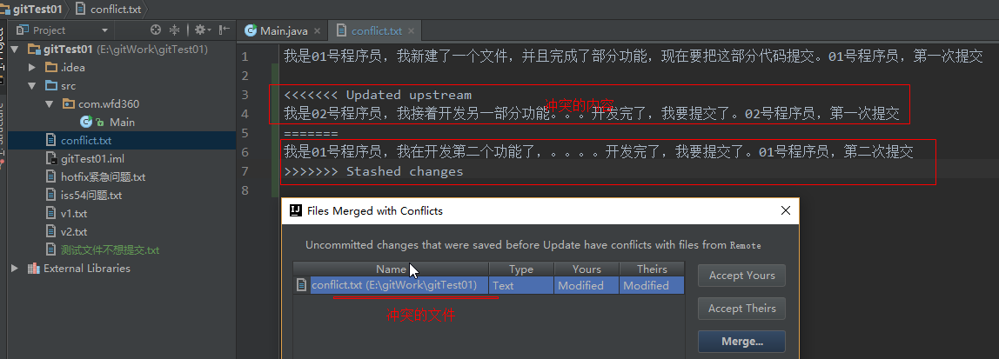

2)  **解决方法**

**accept yours:代表以自己的为准；**

**accept theris:代表以更新下来的文件为准；**

**merge:代表手动合并**

**一般解决冲突我们都是选择merge**

**图片示例：**

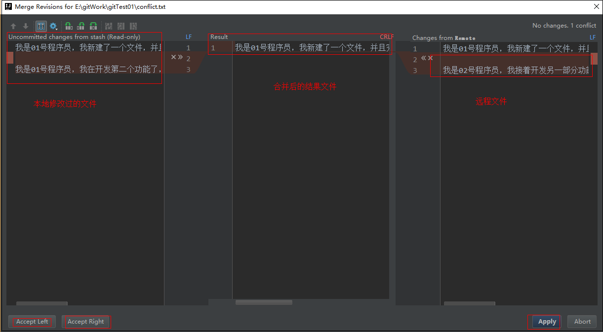

将需要的内容点击：\"\>\>\"既可以合并内容到result中，不需要的内容点击"x"即可，合并完成后点击apply即可。

值得注意的是，最将所有的"x
\>\>"符号都要处理完，不需要的点击"x",需要的点击"\>\>"

最后，不论是什么场景下产生的冲突解决方法是一样的。

maven使用指导
-------------

#### 配置系统变量

1)  点击【地电脑】 进入
    点击鼠标右键并点击【属性】；然后找到【高级系统设置】然后点击进入配置窗口；如图：

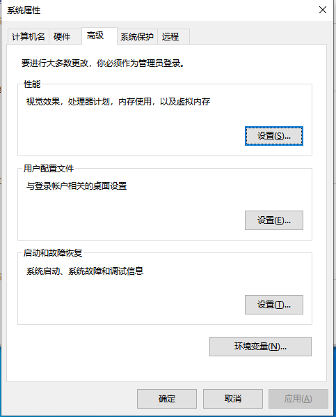

2)  然后点击【环境变量】按钮，找到【系统变量】，点击新建按钮，变量名填写"MAVEN\_HOME"，变量值填写maven文件的根目录

> 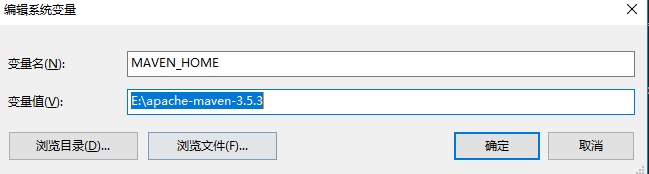

3)  再找到系统变量中的Path变量，点击编辑后新增一个%MAVEN\_HOME%\\bin属性，然后确定即可

> 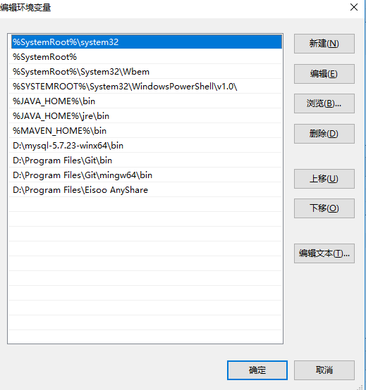

4)  最后通过cmd，并输入【mvn -v】，显示版本信息即可

> 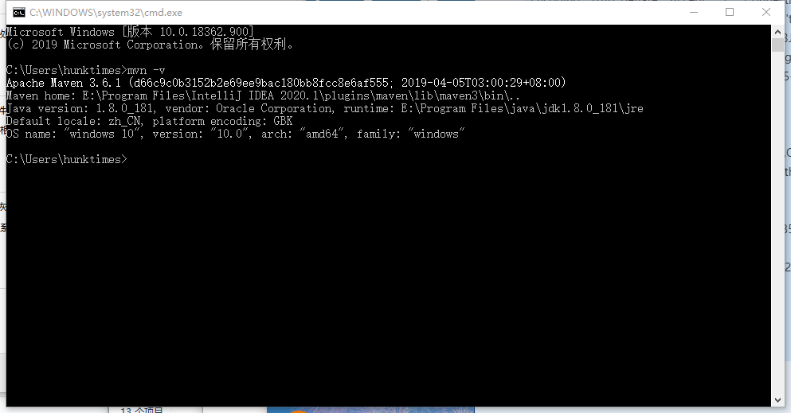

#### Maven配置settings.xml

1.配置jar包下载的路径
```xml
<!--配置jar包下载的路径-->
<localRepository>E:\\repos4\</localRepository>
```
2.配置maven私服的账号密码
```xml
<servers>
<!--配置maven私服的账号密码 -->
    <server>
        <id>mesrelease</id>
        <username>deployment</username>
        <password>deployment</password>
    </server>

    <server>
    <id>framework</id>
    <username>deployment</username>
    <password>deployment</password>
    </server>
</servers>
```
3.配置反射地址
```xml
<mirrors>
<mirror>
    <id>alimaven</id>
    <mirrorOf>central</mirrorOf>
    <name>aliyun maven</name>
    <url>http://maven.aliyun.com/nexus/content/repositories/central/</url>
</mirro>

<mirror>
    <id>mesrelease</id>
    <mirrorOf>*</mirrorOf>
    <name>Mesrelease</name>
    <url>http://192.168.4.20:10081/nexus/content/repositories/mesrelease/</url>
</mirror>

<mirror>
    <id>framework</id>
    <mirrorOf>*</mirrorOf>
    <name>framework</name>
    <url>http**:**//192.168.4.20:10081/nexus/content/repositories/framework/</url>
</mirror>

<mirror>
    <id>agile</id>
    <mirrorOf>*</mirrorOf>
    <name>agile\</name>
    <url>http://nexus.agilebpm.cn/nexus/content/groups/public/</url>
</mirror>
</mirrors>
```
4.配置服务地址
```xml
<profiles>
    <profile>
        <id>sonar</id>
        <activation>
            <activeByDefault>true</activeByDefault>
        </activation>
        <properties>
            <!-- Optional URL to server. Default value is http://localhost:9000 -->
            <sonar.host.url>
                http://172.16.100.175:9000
            </sonar.host.url>
        </properties>
    </profile>

    <profile>
        <id>jdk-1.8</id>
        <activation>
            <activeByDefault>true</activeByDefault>
            <jdk>1.8</jdk>
        </activation>
        <properties>
            <maven.compiler.source>1.8</maven.compiler.source>
            <maven.compiler.target>1.8</maven.compiler.target>
            <maven.compiler.compilerVersion>1.8</maven.compiler.compilerVersion>
        </properties>
    </profile>

    <profile>

        <id>mesrelease</id>
        <repositories>
            <repository>
                <!--仓库id，repositories可以配置多个仓库，保证id不重复-->
                <id>lesso-mes</id>
                <!--仓库地址，即nexus仓库组的地址-->
                <url>http://192.168.4.20:10081/nexus/content/repositories/mesrelease/</url>
            </repository>
        </repositories>
    </profile>

    <profile>
        <id>framework</id>
        <repositories>
            <repository>
                <!--仓库id，repositories可以配置多个仓库，保证id不重复-->
                <id>framework</id>
                <!--仓库地址，即nexus仓库组的地址-->
                <url>http://192.168.4.20:10081/nexus/content/repositories/framework/</url>
            </repository>
        </repositories>
    </profile>

    <profile>
        <id>nexus-agile-bpm</id>
        <repositories>
            <repository>
                <!--仓库id，repositories可以配置多个仓库，保证id不重复-->
                <id>nexus-agile-bpm</id>
                <!--仓库地址，即nexus仓库组的地址-->
                <url>http://nexus.agilebpm.cn/nexus/content/groups/public/</url>
            </repository>
        </repositories>
    </profile>

</profiles>
```
5.需要读取的配置
```xml
<activeProfiles>
    <activeProfile>framework</activeProfile>
    <activeProfile>mesrelease</activeProfile>
    <activeProfile>custom-compiler</activeProfile>
</activeProfiles>
```


#### Maven常用指令

1)  mvn clean 清理项目生产的临时文件,一般是模块下的target目录

2)  mvn
    package项目打包工具,在模块下的target目录生成jar或war等文件，如下运结果

3)  mvn test 测试命令,或执行src/test/java/下junit的测试用例.

4)  mvn install 说明: 模块安装命令
    将打包的的jar/war文件复制到你的本地仓库中,供其他模块使用
    -Dmaven.test.skip=true 跳过测试(同时会跳过test compile)

5)  mvn deploy 发布命令
    将打包的文件发布到远程参考,提供其他人员进行下载依赖
    ,一般是发布到公司的私服;

镜像打包脚本gitlab-ci.yml
-------------------------

#### gitlab-ci.yml说明

gitlab-ci.yml其实是gitlab中的脚本，我们通常使用这个脚本进行jar包的deploy和镜像的打包，后来还加上了sonar的代码扫描

```yaml
stages:
- deploy_service
- build_service-dev

job0:
 stage: deploy_service
 script:
   - mvn clean deploy -f ./lesso-perScore-facade/pom.xml -e
 tags:
   - mavenrunner05

job1:
 stage: build_service-dev
 script:
    - mvn clean package -f ./ci_service_pom.xml
    - docker login 172.16.100.39 -u harbor -p Harbor
    - docker build -t 172.16.100.39/maven/lesso-perscore-service:1.0 ./ -f ./lesso-perScore-service/dockerfile_service
    - docker push 172.16.100.39/maven/lesso-perscore-service:1.0
    - docker rmi 172.16.100.39/maven/lesso-perscore-service:1.0
 only:
  - dev
 tags:
  - mavenrunner11
```


|参数|说明|                                                     
---|---|
| stages | 表示构建阶段，说白了就是上面提到的流程。默认有2个stages：build以在一次Pipeline中定义多个Stages，这些Stages会有以下特点:                                                         
|        | 1．所有Stages会按照顺序运行，即当一个Stage完成后，下一个Stage才会开始                                                         
|        | 2．只有当所有Stages完成后，该构建任务(Pipeline)才会成功                                                                
|        | 3．如果任何一个Stage失败，那么后面的Stages不会执行，该构建任务(Pipeline)失败表示构建工作，表示某个Stage里面执行的工作。    
|  job   | 我们可以在stages里面定义多个jobs，这些jobs会有以下特点：                                                         
|        | 1．相同stage中的jobs会并行执行                                                                                           
|        | 2．相同stage中的jobs都执行成功时，该stage才会成功                                                                           
|        | 3．如果任何一个job失败，那么该stage失败，即该构建任务(Pipeline)失败                                                            
| stage  | 对应着stages，指运行阶段                                  
| script | 具体脚本执行的工作，比如说打包jar包，打包镜像的指令，就是在这里写                                                 
| only   | 可选参数，如果写了，就只在都对应的分支进行该步骤          
| tags   | 打包jar和镜像都是需要依赖一台机器去进行的， tags就是选择进行打包的机器，可选mavenrunner01 - mavenrunner13                                                                         


#### dockerfile说明

dockerfile是docker镜像打包的基础文件，gitlab-ci.yml在打包镜像的时候，需要依赖dockerfile中的配置和指令进行。

```dockerfile
FROM  172.16.100.39/maven/java:v8u212
ENV JAVA_OPTS ${JAVA_OPTS}
COPY . /home
WORKDIR /home/auth-web

ENTRYPOINT []
CMD java ${JAVA_OPTS} -Dlog4j.configurationFile=log4j2-prod.xml -jar /home/auth-web/target/auth-function-web.jar --spring.profiles.active=$spring_profiles_active
```

Rancher使用指导
---------------

#### 简介

Rancher是一个开源的企业级容器管理平台。
通过Rancher，企业再也不必自己使用一系列的开源软件去从头搭建容器服务平台。
Rancher提供了在生产环境中使用的管理Docker和Kubernetes的全栈化容器部署与管理平台。
Rancher可以使用任何公有云或者私有云的Linux主机资源。

联塑Rancher的 环境地址：

-   开发环境：<http://172.16.100.39:10080/>

-   正式环境：<http://rancher.lesso.com/login>

#### 添加编排

1)  进入Rancher网站服务，登陆进入Rancher。

2)  左上角选择对应环境。

> 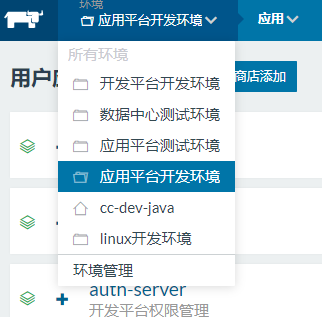{width="2.773584864391951in"
> height="2.7305172790901135in"}

3)  点击【添加应用】按钮后进入服务编排页面，如图所示：

    -   **名称** 表示应用名称【请与服务编码保持一致】

    -   **描述** 表示对该应用的表述和简洁

    -   **可选**docker-compose.yml
        表示应用中的所有docker容器的配置【可选的】

    -   **可选**rancher-compose.yml
        表示应用中的所有docker容器关联rancher的配置【可选的】

> 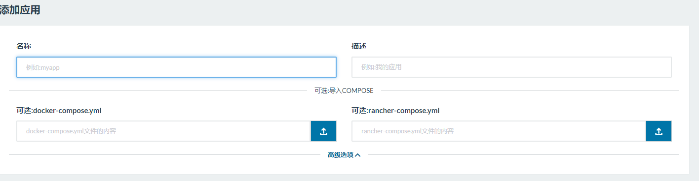

4)  添加应用成功后，进入应用，点击添加服务，根据服务填写镜像地址、端口映射（端口也可以通过haproxy进行映射）、环境变量、标签和调用。

> 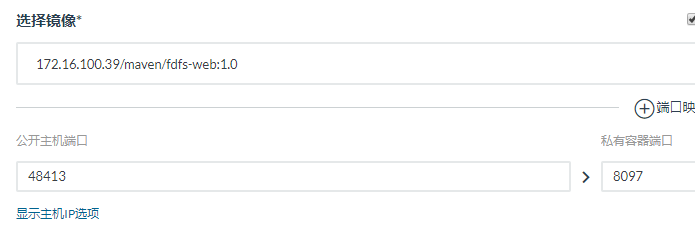
>
> 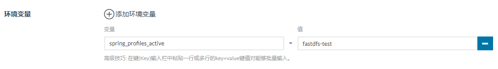
>
> 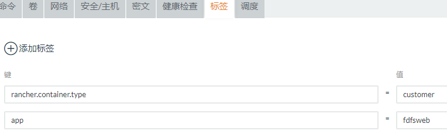
>
> 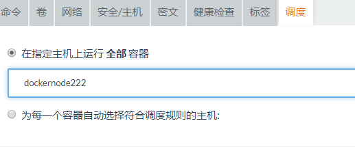

#### Rancher的日常维护工作

1)  服务升级

> 登陆进入rancher的服务编排页面，点击进入需要的升级的服务编排界面，如图所示：
>
> 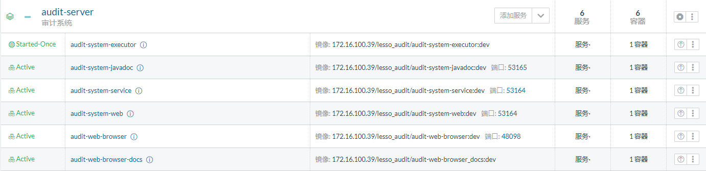
>
> 上图中的只要的字段的含义如下：

-   第一列 Active 容器的运行状况

-   第二列
    > [app-authority-admin](http://172.16.100.39:10080/env/1a158668/apps/stacks/1st1025/services/1s5279) 
    > 容器服务名称

-   第三列 镜像:容器服务拉取镜像的地址 端口：容器服务对外暴露的端口
    > 例如：镜像:72.16.xxx.xx/lessoauth/lesso-app-authority-admin:platform-dev
    > 端口:49346

-   第四列 服务

-   第五列 该服务下容器数量

-   第六列 操作按钮

> 开发环境和测试环境通常镜像地址都不会变，所以直接点升级即可，而生产环境要求每次升级前都要更新镜像版本，所以正式环境升级记得修改镜像的最新版本。
>
> 

2)  服务回滚

通常升级完成后，服务状态就会变成"Upgraded",这时候操作项中会有"升级完成"和"回滚"两个操作，如果点击升级完成后，服务状态就会变成"Active"，Active状态的服务是无法回滚的。如果都点击回滚，那么服务就会恢复到上一个镜像的版本。

> 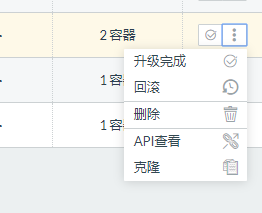

3)  日志查看

> 日志查看是查看服务控制台输出的内容，但这些日志会不断的刷新，并且会把旧的日志覆盖掉，而且升级镜像后，日志就会自动清空。
>
> 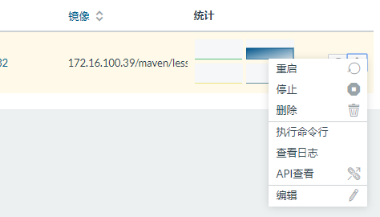
>
> 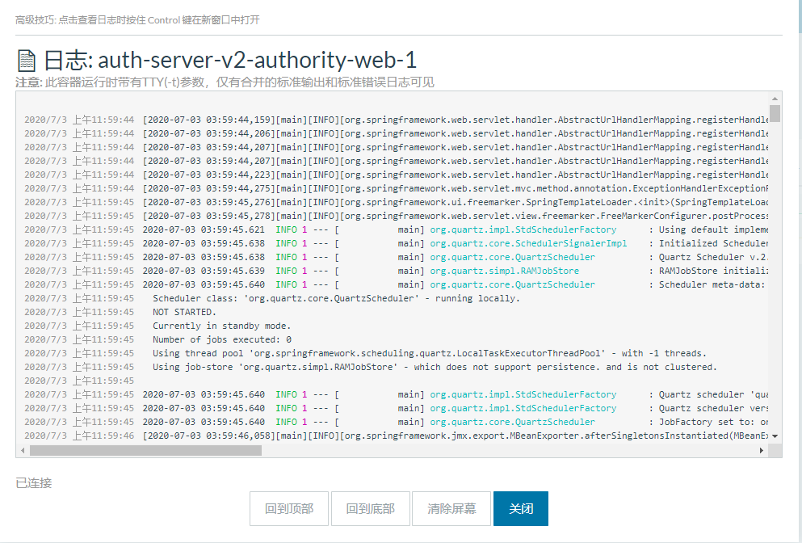{

4)  执行命令行

> 执行命令行是操作容器的，所以不清楚命令请不要随意操作，而且就算你修改了容器的内容，在下一次容器升级后，修改的内容就会消失。
>
> 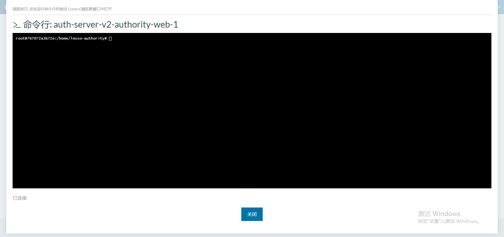

5)  服务的自动升级

鼠标光标移到【API】下拉导航栏出；就会出现红框选中的【Webhooks】按钮，并点击进入自动化部署配置列表页面

如下图所示：

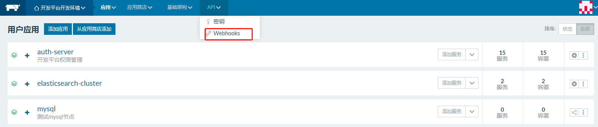

点击示例图片中的【添加接收器】按钮；进入自动化部署升级配置界面；如图所示：

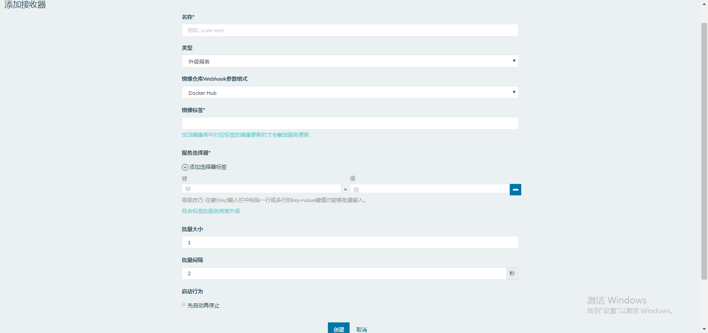

示例中的各个主要的填写框含义如下：

-   **名称** 接受器名称（唯一，不可重复）命名格式为：update-应用名称
    例如：update-app-authority-admin

-   **类型** 接收器的类型
    例如：升级服务，扩缩容服务，扩缩容主机；这里的是我们要选择升级服务类型

-   **镜像标签** 镜像仓库中的镜像标签

-   **服务器选择** 选择自动升级的应用服务
    这里是以标签的形式实现；其中标签对应关系为应用服务创建的时候设置的标签；如图所示：
    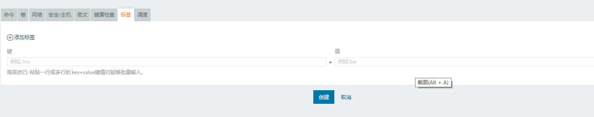

最后点击【创建按钮】；完成创建；

修改gitlab-ci.yml文件

到需要进行自动话部署升级的项目的根目录下找到gitlab-ci.yml文件；如图所示：

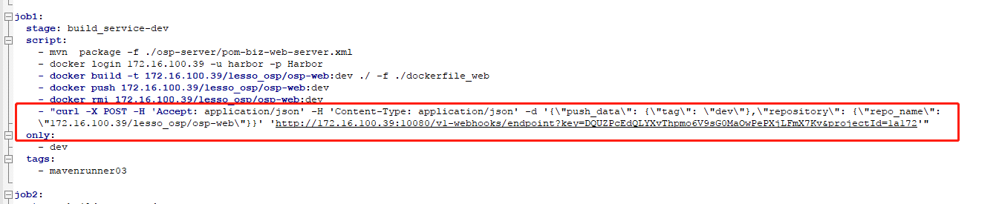

```yaml
"curl -X POST -H 'Accept: application/json' -H 'Content-Type: application/json' -d '{\"push_data\": {\"tag\": \"dev\"},\"repository\": {\"repo_name\": \"172.16.100.39/lesso_osp/osp-web\"}}' 'http://172.16.100.39:10080/v1-webhooks/endpoint?key=DQUZPcEdQLYXvThpmo6V9sG0MaOwPePXjLFmX7Kv&projectId=1a172'"
```

其中的字段含义为：

-   **push\_data** 为推送消息体对象

-   **tag** 镜像标签

-   **repository** 仓库服务

-   **repo\_name** rancher服务地址

**重点的是"<http://172.16.100.39:10080/v1-webhooks/endpoint?key=>"中的这个key，这个key是rancher中的webhooks里面复制过来的。**

nexus使用指导
-------------

#### 什么是nexus

Nexus是一个强大的Maven仓库管理器，它极大地简化了自己内部仓库的维护和外部仓库的访问。
利用Nexus你可以只在一个地方就能够完全控制访问和部署在你所维护仓库中的每个Artifact。
Nexus是一套"开箱即用"的系统不需要数据库，它使用文件系统加Lucene来组织数据。

Nexus不是Maven的核心概念，它仅仅是一种衍生出来的特殊的Maven仓库。对于Maven来说，仓库只有两种：本地仓库和远程仓库。

> 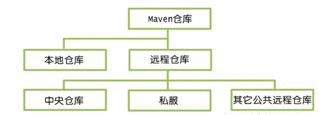

本地仓库就是我们在maven的setting.xml中配置的本地仓库地址。由于最原始的本地仓库是空的，Maven必须知道至少一个可用的远程仓库，才能在执行Maven命令的时候下载到需要的构件。

中央仓库是maven默认的远程仓库。

私服是架设在局域网的一种特殊的远程仓库，目的是代理远程仓库及部署第三方构件。有了私服之后，当
Maven
需要下载构件时，直接请求私服，私服上存在则下载到本地仓库；否则，私服请求外部的远程仓库，将构件下载到私服，再提供给本地仓库下载。

#### Nexus的基本使用

1)  查看jar包

> 左上角Artiface
> Search能搜索jar包，搜到对应jar包后，右边就会显示jar包的具信息。带sources后缀的jar包，就是源码包。右下角maven表示maven的xml配置，Artifact表示能直接下载jar包到本地
>
> 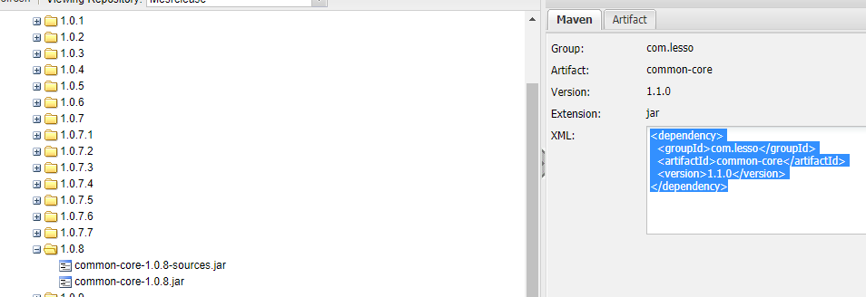
>
> 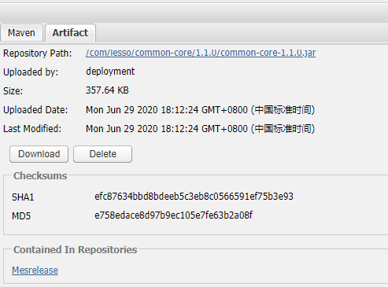

2)  上传jar包

> 上传jar包首先要使用账号登陆nexus，选择Mesrelease，点击Artifact
> Upload，选择GAV
> Parameters，填写jar包相关group、Artifact、version，然后Packaging选择jar，再把对应的jar包上传，点击提交后就可以上传成功。
>
> 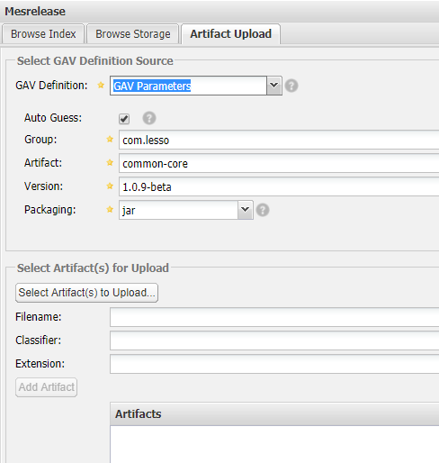