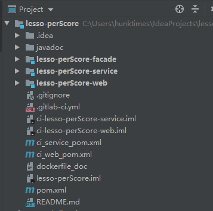
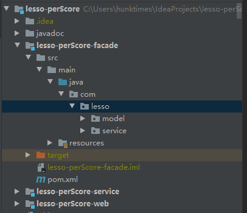
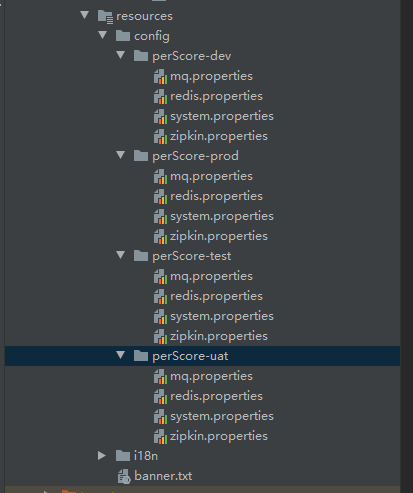
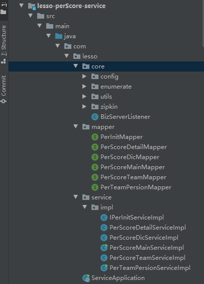
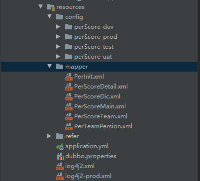

# 项目结构说明

## 结构说明

Lesso微服务平台生成的项目的主要架构是zookeeper+dubbo+spring+springBoot+mybatis-plus;项目结构只要分为3个部分；facade，service，web，示例如下图所示：

### Facade

**facade包的主要作用是放置service和web包的公共配置，所用的实体，常量，枚举和服务接口；**

* 包命名规范必须以：com.lesso.xxx.xxx 这样的格式；其主要（默认自带）分为2个部分（若有枚举和常量池，请根据项目需求命名）；
* 存放实体的统一放在com.lesso.model中；model中存放的实体可以具体根据项目需求来划分；
* 存放服务接口同意放在com.lesso.service中；service中存放的接口类可以具体根据项目需求来划分。
* 存放配置文件放在resources的config中，配置文件通常分为dev（本地环境）、test（开发环境）、uat（测试环境）、prod（生产环境）；
* 其他系统在rpc服务的时候，就是引用façade的jar包，进行接口的调用，所以façade只放接口和实体，不放实现。

> Facade文件夹结构如下图

### Service

**Service包的主要作用是放置项目的服务层业务代码和与业务代码有关的配置和实体；**
**该工程的包路径命名规范为：com.lesso.xxxx.xxxx**

总体分为3个部分：

* com.lesso.core:该包中主要存放service工程用到的工具包（lesso的common-util包没有的工具而且又是仅仅适用于本项目的才能自己创建，不然必须使用lesso开发平台提供的工具包），拦截器，过滤器，实例注入配置等等；
* com.lesso.mapper:该包主要存放的是orm框架mybatis-plus用到的数据映射接口；
* com.lesso.service.impl:该包主要是存放的是facade包中的服务接口的实现类；为业务代码的主要编写处；
* 配置文件的存放规则（resources）:主要存放该工程的各种环境所用到的数据源，只适用于该工程的配置，mapper映射xml文件和日志输出配置；

> Service文件夹结构如下图

### Web

**Web包的主要作用是放置项目的控制层务代码和与业务代码有关的配置和实体，主要是暴露对外访问的接口；**
**该工程的包路径命名规范为：com.lesso.xxxx.xxxx**

总体分为2个部分：

* com.lesso.web：该包主要放置的是项目的controller接口；
* com.lesso.core：该包中主要存放web工程用到的工具包（lesso的common-util包没有的工具而且又是仅仅适用于本项目的才能自己创建，不然**必须使用lesso开发平台提供的工具包**），拦截器，过滤器，实例注入配置等等；