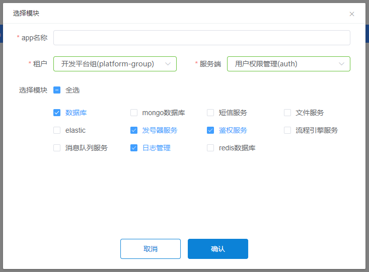

# 代码生成指导

## 模板选择参数说明

1. app名称：代表你项目的英文名称，这个基本**和服务端的名称一样**
2. 租户：租户由**平台同事**负责新建，**生成项目前必须先新建租户**
3. 服务端：服务端由**项目经理**新建，**生成项目前必须先新建服务端**
4. 选择模块：模块包括数据库、mogodb、短信、文件、elastic、发号器服务、鉴权服务、流程引擎服务、消息队列服务、日志服务、redis数据服务。请根据项目具体需求，勾选对应模块即可。
5. 环境配置有dev（本地）、test（开发）、uat（测试）、prod（正式），如果没uat和prod环境，可以先不用填这两个。



## 数据库参数

请根据数据库的名称、地址、端口、账号密码配置，如果没做读写分离，那读写配置一样即可。项目生成时候，会根据数据库里面的表，自动生成实体和接口。**备注：数据库密码需要先加密再写进去，加密数据库密码请找平台组同事。**

> 数据库配置

``` JSON
"jdbc": {
    "config-dev": {
        "dialectType": "mysql",
        "driverClassName": "com.mysql.jdbc.Driver",
        "readerUrl": "jdbc:mysql://172.16.100.30:4411/读库库名?useUnicode=true&characterEncoding=utf8&allowMultiQueries=true&autoReconnect=true&autoReconnectForPools=true&failOverReadOnly=false&useSSL=false",
        "readerUsername": "读库账号",
        "readerPassword": "读库密码",
        "writerUrl": "jdbc:mysql://172.16.100.30:4411/写库库名?useUnicode=true&characterEncoding=utf8&allowMultiQueries=true&autoReconnect=true&autoReconnectForPools=true&failOverReadOnly=false&useSSL=false",
        "writerUsername": "写库账号",
        "writerPassword": "写库密码"
    }
},
```

## auth鉴权参数
auth配置中只有redisPrivateKey一个参数，key是自动生成的。这个参数的作用是：redis通信的时候需要做加密解密，redis监听的内容都是加密过的，订阅的时候需要解密。

``` JSON
"auth": {
    "config-dev": {
        "redisPrivateKey":"MIIBVgIBADANBgkqhkiG9w0BAQEFAASCAUAwggE8AgEAAkEAlSpAeSbDQ0NEes4KdZnbti/7MmzzY+BiUuCH6kevB3UghEAzbbE7KZVdNY9ofnNXrrXrVmyLT5J7Ronkg7NIfQIDAQABAkA5spw5wJqq++wTLHuzPY5VDH435RjIO1UNBbjNEGlNkpOD86CC1VajORKPboxEiFbvQ67YYRVzGXb6w/Ez0DdpAiEAyNMEYLg+mZTxkdtJNqU1XbA+wNuSwXC9TUhufiGiMK8CIQC+JcfJB5dqapJoHlZ6CvYpGRRHdljzvMqI8D4PCFDskwIhAJG2irai+Mj3CVCLi9Pai54vA1lr+E/jPXeV1pYuUUCBAiEAuEitY+vzl7NJyZb9gLJ2+EXSHaBZfYAPWsBbpP4OT/kCIQCMNzLpDiBQQVfMd+Yl4g2dwcnIlsLsui6TjVx0CdxR2g=="
    }
}
```

## mongodb参数

mongodb配置也和数据库一样，分别配置地址、端口、数据库名称、账号密码。这个数据库密码不用加密，直接写进入就可以了。

``` JSON
"mongo": {
    "config-dev": {
        "defaultHost": "172.16.100.73",
        "defaultPort": "2000",
        "defaultDatabase": "库名",
        "defaultUsername": "用户",
        "defaultPassword": "密码"
    }
}
```

## redis参数

redis分别配置地址、端口、账号密码。这个数据库密码加密，加密请找平台组同事加密。

``` JSON
"redis": {
    "config-dev": {
        "defaultHost": "172.16.100.31",
        "defaultPort": "26379",
        "defaultPassword": "dI0V85mGpM9+p+h0M2zaTM=="
    }
}
```

## 其他配置

其他服务配置都基本固定，所以没必要在生成项目的时候去动态配置，只需要用默认的配置即可。格式如下：
``` JSON
"config": {
    "file": {},
    "elastic": {},
    "vesta": {},
    "message": {},
    "oa": {},
    "mq": {},
    "zipkin": {}
}
```