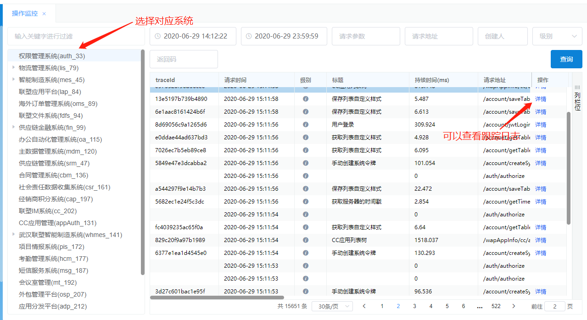
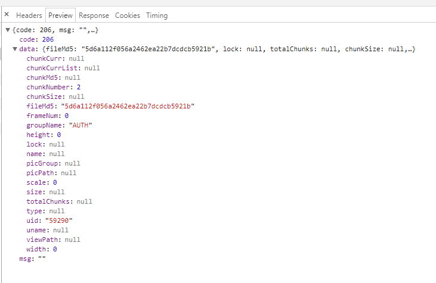
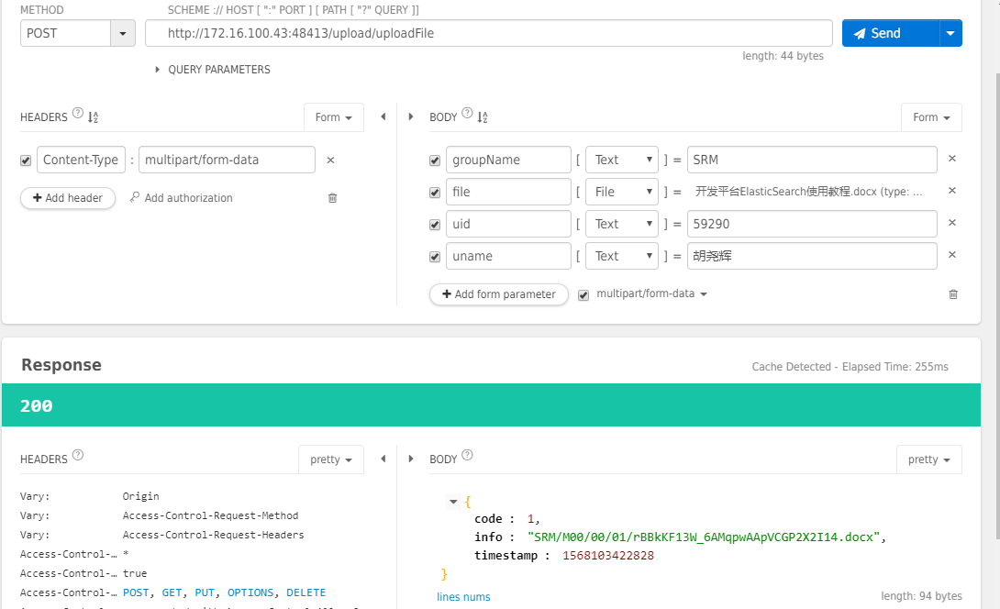

# 中间件使用指导

## common-util - 公共util包

### 介绍

util包包含了我们常用的util，使用非常简单，并且网上有众多例子，所以这里不仔细介绍每个包里的方法，只作简单的列表展示。

util名称                  | 说明 
:--                       | :--
AESUtil                   | AES 双向加密解密辅助类
ArrayUtil                 | 数组操作辅助类
Base64Decoder             | Base64解码辅助类
Base64Encoder             | Base64转码辅助类
Base64Util                | 图片转Base64辅助类
BeanMetaDataRegistCenter  | Bean中metaData操作辅助类
BeanPropertyMetaData      | Bean中metaData判断辅助类
BeanToMapUtil             | Bean转Map辅助类
BeanTypeUtil              | Bean类型判断辅助类
BeanUtil                  | Bean转换处理类
CacheUtil                 | 缓存处理服务类
CodeUtil                  | 获取权限登陆相关参数的util
CollectionsUtil           | 对集合操作的util
CompressUtil              | 文件压缩处理util
ConditionUtil             | 存放参数的实体util（已弃用）
DataUtil                  | 对参数操作的常用辅助类
DateUtil                  | 日期操作辅助类
DownloadExcelUtil         | Excel下载辅助类
DubboUtil                 | Dubbo参数获取辅助类
EncodesUtil               | 封装各种格式的编码解码工具类
ExcelReaderUtil           | 读取excel辅助工具
ExceptionUtil             | 关于异常的工具类
FileUtil                  | 文件处理辅助类
HashUtil                  | Hash转换辅助类
HttpUtil                  | http解析辅助类
IDCardUtil                | 身份证验证辅助类
ImageUtil                 | 图片处理辅助类
InstanceUtil              | 实例辅助类
IpUtil                    | 获取IP辅助类
JsonWebTokenUtil          | JWT解析辅助类
LocationUtil              | 定位计算辅助类
MacUtil                   | Mac地址获取辅助类
MapToBeanUtil             | Map与Bean转换辅助类
MathUtil                  | 数值计算辅助类
NativeUtil                | 获取机器名和网卡序列辅助类
ObjectUtil                | Object操作辅助类
OpenOfficeUtil            | Office文件转换辅助类
ParamType                 | 判断输入框参数类型
PinyinUtil                | 汉字辅助类
PoiUtil                   | Poi office文件辅助类
PropertiesUtil            | 配置文件参数获取辅助类
QrcodeUtil                | 二维码辅助类
ReflectionsUtil           | 反射工具类. 提供调用getter/setter方法, 访问私有变量, 调用私有方法, 获取泛型类型Class, 被AOP过的真实类等工具函数
Request2ListUtil          | Request参数转List辅助类
Request2ModelUtil         | Request参数转Model辅助类
RMBUtil                   | 数字转RMB中文字符辅助类
SecurityUtil              | 数据加密辅助类(默认编码UTF-8)
SerializeUtil             | 序列化辅助类
ShiroUtil                 | Shiro辅助类
StreamUtils               | Stream流转换辅助类
StringUtil                | 字符串辅助类
StringUtils               | 字符串辅助类
TableBuilder              | 数据库表操作辅助类（已弃用）
Thread                    | 线程操作辅助类
TokenUtil                 | Token操作辅助类
TypeParseUtil             | 类型转换辅助工具类
WebServiceUtil            | WebService连接辅助类
WebUtil                   | Web层辅助类
XmlUtil                   | XML处理辅助类
XssUtil                   | Web防火墙工具类

### 使用说明

**注意事项：common-core里面包含了common-util，所以如果引用core包，就不用引util包。** 

> 引入：只要pom中引用对应的common-util，就能使用以上util类

``` XML
<dependency>
    <groupId>com.lesso</groupId>
    <artifactId>common-util</artifactId>
</dependency>
```

***


## common-core - 核心架构包

### 介绍

1. common-core包是我们springboot架构的核心包，里面包括了springboot架构、dubbo服务、zookeeper服务。

2. 日志拦截也是在core包中，还有自定义的Exception下面列举一下我们常用的Exception。

类型 | 作用
:-- | :--
BaseException     | 抽象类，继承Exception类，自定义报错
LocaleException   | 自动翻译中英文的报错，要搭配i18n配置文件使用
ServiceException  | 继承BaseException，返回业务型的报错，如：XX不能为空！
BaseRpcException  | Rpc调用时候报错时候使用

3. Config中包括以下三个内容

类型 | 作用
:-- | :--
Configs.java      | 用于加载配置文件的Config
LocaleConfig.java | 配置国际化语言注入的Config
WebMvcConfig      | 主要处理页面和地址配置的Config，包括：<br>1. 资源的重定向<br>2. 统一日期格式化<br>3. 允许所有跨域请求<br>4. 限制上传文件的大小

### 使用说明

**注意事项：common-core里面包含了common-util，所以如果引用core包，就不用引util包。** 

> 引入：只要pom中引用对应的core包

``` XML
<dependency>
    <groupId>com.lesso</groupId>
    <artifactId>common-core</artifactId>
</dependency>
```

*因为common-core使用了springboot的包，所以使用时候需要添加一下配置。*

#### 相关配置

1. system.properties：（不同环境配置不同，这个以开发环境为例）

``` properties
rpc.provider.name=lesso-test-service
rpc.consumer.name=lesso-test-web
rpc.provider.port=18080
rpc.consumer.port=18081
rpc.registry.id=lesso-test
rpc.registry.group=dev-lesso-test
rpc.registry.version=0.1.0
rpc.address=zookeeper://172.16.100.30:2181
rpc.consumer.retries=3
rpc.consumer.check=false
rpc.timeout=1800000
```

2. application.yml：（不同环境配置不同，这个以开发环境为例）

``` YML
server:
  name: lesso-test-service
  port: 8080
  tomcat:
    max-threads: 1000
    min-spare-threads: 30

spring:
  profiles:
    active:
      - test-dev
  jackson:
    time-zone: GMT+8
    date-format: yyyy-MM-dd HH:mm:ss
  thymeleaf:
    cache: false

logging:
  level:
    com.lesso.mapper: debug
```

****


## common-database - 数据库服务包

### 介绍

1. common-database包含了druid数据库连接池、sharding-jdbc数据库架构、mybatis-plus架构，简单来说就是一个用于连接数据库的工具包。

2. druid数据库连接池只要就是和数据库的交互，在每个项目的service模块，都有配置对应的数据库信息。

3. sharding-jdbc数据库架构其实包括很多的功能，在common-database包中，我们主要使用sharding-jdbc的读写分离和数据脱敏。

### 使用说明

> 引入：在service的pom中引入该jar包，因为service是和数据库交互的。

``` XML
<dependency>
    <groupId>com.lesso</groupId>
    <artifactId>common-database</artifactId>
</dependency>
```

#### 相关配置

1. 读写分离配置例子：（不同环境配置不同，这个以开发环境为例）

``` properties
druid.key=
# 数据库驱动
druid.default.driverClassName=com.mysql.jdbc.Driver
# 主库地址
druid.writer.default.url=jdbc:mysql://localhost:3306/lesso_per_score?useUnicode=true&characterEncoding=utf8&allowMultiQueries=true&autoReconnect=true&autoReconnectForPools=true&failOverReadOnly=false&useSSL=false
# 主库用户
druid.writer.default.username=root
# 主库密码
druid.writer.default.password=YTb27jfWr3ZqCFDxpRy2WM==
# 从库地址
druid.reader.default.url=jdbc:mysql://localhost:3306/lesso_per_score?useUnicode=true&characterEncoding=utf8&allowMultiQueries=true&autoReconnect=true&autoReconnectForPools=true&failOverReadOnly=false&useSSL=false
# 从库用户
druid.reader.default.username=root
# 从库密码
druid.reader.default.password=YTb27jfWr3ZqCFDxpRy2WM==
```

1. 第一点：`mybatis-plus`是`mybatis`的增强架构，它封装了很多单表查询的方法，和`hibernate`一样，用户不需要写单表查询的方法，直接调用`mybatis-plus`封装好的方法就可以了。
2. 第二点：`mybatis-plus`增加了一个`Wrapper<T>`方法，它是一个sql构造器，可以构造各式各样的sql语句，也是省了写sql语句的麻烦。

*BaseMapper接口方法参见下面代码*

> BaseMapper接口

``` JAVA
/**
 * <p>
 * Mapper 继承该接口后，无需编写 mapper.xml 文件，即可获得CRUD功能
 * </p>
 * <p>
 * 这个 Mapper 支持 id 泛型
 * </p>
 *
 * @author hubin
 * @Date 2016-01-23
 */
public interface BaseMapper<T> {

    /**
     * <p>
     * 插入一条记录
     * </p>
     *
     * @param entity 实体对象
     * @return int
     */
    Integer insert(T entity);

    /**
     * <p>
     * 插入一条记录
     * </p>
     *
     * @param entity 实体对象
     * @return int
     */
    @Deprecated
    Integer insertAllColumn(T entity);

    /**
     * <p>
     * 根据 ID 删除
     * </p>
     *
     * @param id 主键ID
     * @return int
     */
    Integer deleteById(Serializable id);

    /**
     * <p>
     * 根据 columnMap 条件，删除记录
     * </p>
     *
     * @param columnMap 表字段 map 对象
     * @return int
     */
    Integer deleteByMap(@Param("cm") Map<String, Object> columnMap);

    /**
     * <p>
     * 根据 entity 条件，删除记录
     * </p>
     *
     * @param wrapper 实体对象封装操作类（可以为 null）
     * @return int
     */
    Integer delete(@Param("ew") Wrapper<T> wrapper);

    /**
     * <p>
     * 删除（根据ID 批量删除）
     * </p>
     *
     * @param idList 主键ID列表
     * @return int
     */
    Integer deleteBatchIds(@Param("coll") Collection<? extends Serializable> idList);

    /**
     * <p>
     * 根据 ID 修改
     * </p>
     *
     * @param entity 实体对象
     * @return int
     */
    Integer updateById(@Param("et") T entity);

    /**
     * <p>
     * 根据 ID 修改
     * </p>
     *
     * @param entity 实体对象
     * @return int
     */
    Integer updateAllColumnById(@Param("et") T entity);

    /**
     * <p>
     * 根据 whereEntity 条件，更新记录
     * </p>
     *
     * @param entity  实体对象(更新的数据， name='Abc')
     * @param wrapper 实体对象封装操作类（更新条件，可以为 null）
     * @return
     */
    Integer update(@Param("et") T entity, @Param("ew") Wrapper<T> wrapper);

    /**
     * <p>
     * 根据 whereEntity 条件，更新记录
     * </p>
     *
     * @param setStr  set字符串
     * @param wrapper 实体对象封装操作类（可以为 null）
     * @return
     */
    Integer updateForSet(@Param("setStr") String setStr, @Param("ew") Wrapper<T> wrapper);

    /**
     * <p>
     * 根据 ID 查询
     * </p>
     *
     * @param id 主键ID
     * @return T
     */
    T selectById(Serializable id);

    /**
     * <p>
     * 查询（根据ID 批量查询）
     * </p>
     *
     * @param idList 主键ID列表
     * @return List<T>
     */
    List<T> selectBatchIds(@Param("coll") Collection<? extends Serializable> idList);

    /**
     * <p>
     * 查询（根据 columnMap 条件）
     * </p>
     *
     * @param columnMap 表字段 map 对象
     * @return List<T>
     */
    List<T> selectByMap(@Param("cm") Map<String, Object> columnMap);

    /**
     * <p>
     * 根据 entity 条件，查询一条记录
     * </p>
     *
     * @param entity 实体对象
     * @return T
     */
    T selectOne(@Param("ew") T entity);

    /**
     * <p>
     * 根据 Wrapper 条件，查询总记录数
     * </p>
     *
     * @param wrapper 实体对象
     * @return int
     */
    Integer selectCount(@Param("ew") Wrapper<T> wrapper);

    /**
     * <p>
     * 根据 entity 条件，查询全部记录
     * </p>
     *
     * @param wrapper 实体对象封装操作类（可以为 null）
     * @return List<T>
     */
    List<T> selectList(@Param("ew") Wrapper<T> wrapper);

    /**
     * <p>
     * 根据 Wrapper 条件，查询全部记录
     * </p>
     *
     * @param wrapper 实体对象封装操作类（可以为 null）
     * @return List<T>
     */
    List<Map<String, Object>> selectMaps(@Param("ew") Wrapper<T> wrapper);

    /**
     * <p>
     * 根据 Wrapper 条件，查询全部记录
     * 注意： 只返回第一个字段的值
     * </p>
     *
     * @param wrapper 实体对象封装操作类（可以为 null）
     * @return List<Object>
     */
    List<Object> selectObjs(@Param("ew") Wrapper<T> wrapper);

    /**
     * <p>
     * 根据 entity 条件，查询全部记录（并翻页）
     * </p>
     *
     * @param rowBounds 分页查询条件（可以为 RowBounds.DEFAULT）
     * @param wrapper   实体对象封装操作类（可以为 null）
     * @return List<T>
     */
    List<T> selectPage(RowBounds rowBounds, @Param("ew") Wrapper<T> wrapper);

    /**
     * <p>
     * 根据 Wrapper 条件，查询全部记录（并翻页）
     * </p>
     *
     * @param rowBounds 分页查询条件（可以为 RowBounds.DEFAULT）
     * @param wrapper   实体对象封装操作类
     * @return List<Map<String, Object>>
     */
    List<Map<String, Object>> selectMapsPage(RowBounds rowBounds, @Param("ew") Wrapper<T> wrapper);

}
```

***


## common-zipkin - 链路日志服务包

### 介绍

1. common-zipkin日志包使用了elk（Elasticsearch、Logstash、Kibana三个组件）和zipkin（链式日志跟踪）。
2. zipkin链路跟踪，主要靠一个traceId（跟踪ID），从Controller->Service->Mapper，贯通整个链路。

### 使用说明

> 引入：因为日志跟踪是整个项目的跟踪，所以需要在父pom里引入common-zipkin包。

``` XML
<dependency>
    <groupId>com.lesso</groupId>
    <artifactId>common-zipkin</artifactId>
</dependency>
```

1. 日志采集其实除了elk，我们还加了一层kafka做缓存层，因为日志并发量太大了，极容易把IO弄爆，所以需要消息队列做缓存。消息队列需要创建topic，我们基本都是使用系统英文名称做topic的。（不同环境配置不同，这个以开发环境为例）

```properties
elk.kafka.urls=172.16.100.60:9091,172.16.100.60:9092,172.16.100.60:9093
elk.kafka.topic=perScore
elk.app.name=perScore
```

2. 除了elk的配置，还有zipkin的独立配置（不同环境配置不同，这个已开发环境为例）

```properties
zipkin.tracing.endpoint=http://172.16.100.40:9411/api/v2/spans
zipkin.tracing.json=http://172.16.100.40:9411/zipkin/api/v2/trace/
app.name=perScore-dev
```

3. 除了自己配置里要加入topic外，在日志采集的镜像里，也要增加对应topic参数才行，这个操作由运维同事处理。


### 查看日志

1. 在微服务系统查看日志，可以根据自己的系统查看到对应的日志（备注：除了正式环境，开发和测试环境的地址有可能会变）

* 开发环境：http://172.16.100.43:49293
* 测试环境：http://172.16.100.28:49294
* 正式环境：http://auth.lesso.com

> 操作界面如下：




2. 2)Kibana中查看系统的日志，是一堆没有经过汇总和分类的日志信息，但是里面的信息是比较全面的，开发人员可以自己编写条件查询对应日志。

* 开发和测试环境：http://172.16.100.40:5601/app/kibana
* 正式环境：http://192.168.3.197:5601/app/kibana

> 操作界面如下：


***


## common-auth - 鉴权服务包

### 介绍

common-auth主要是接口鉴权的作用，所以需要在web引用对应jar包。开启鉴权后所有的接口访问都需要有jwt标识做访问密钥。每个人或每个角色都可以拥有着不同的访问权限，而接口权限的配置，则需要登陆微服务管理平台配置。

### 使用说明

> 引用：在web的pom中引用common-auth的jar包

``` XML
<dependency>
    <groupId>com.lesso</groupId>
    <artifactId>common-auth</artifactId>
</dependency>
```

#### 相关配置

``` properties
#服务端编码
lesso.app.code=auth
#租户编码
lesso.app.tenant.code=platform-group
#shiro鉴权配置
shiro.jwt.timeout=3600
shiro.jwt.retry=600
shiro.old.jwt.live=3
#接口是否开启鉴权
shiro.jwt.enable=true
#权限rpc服务配置
rpc.auth.group=test-auth
rpc.auth.version=0.1.0
rpc.auth.check=false
```

**这里重点说一下shiro部分的配置：**

配置参数 | 说明
:- | :-
shiro.jwt.timeout | 超过N秒不做任何操作，系统自动退出的时间，秒为单位，默认3600秒（一小时）
shiro.jwt.retry | jwt每N秒更换一次，秒为单位，默认600秒
shiro.old.jwt.live | 更换新的jwt后，旧的jwt存活的时间，秒为单位，默认3秒
shiro.jwt.enable | 接口鉴权开关，默认为true，如果直接为false则不鉴权

#### shiro接口白名单
如果有些接口不需要鉴权，可以让任何人访问（如登录和注册接口），则可以直接通过配置web模块下的配置文件shiro.config来实现：
``` properties
/account/jwtLogin=anon;
/account/rmLogin=anon;
/account/createSystemJWTTocken=anon;
/account/getTimeStamp=anon;
/account/retrieve=anon;
```

***


## common-elastic -ES搜索引擎服务包

### 介绍

common-elastic使用Elasticsearch搜索服务，它是一个分布式多用户能力的全文搜索引擎，提供搜集、分析、存储数据三大功能。我们现在的系统操作日志，数据来源就是Elasticsearch。

### 使用说明

1)  在pom中引入common-elastic对应的jar包

```xml
<dependency>
    <groupId>com.lesso</groupId>
    <artifactId>common-elastic</artifactId>
</dependency>
```

2)  配置文件

```properties
elasticsearch.cluster.name=docker-cluster
elasticsearch.cluster.node=172.16.100.216:9300,172.16.100.215:9300
```

### 接口说明
1)  实体对象ElasticSearchParam

  参数|描述|格式
  ---|--|---
  size|分页大小|int
  current|第几页|int
  index|数据分割标签|List\<String\>
  type|数据类型|List\<String\>
  isAsc|是否正序|boolean
  orderBy|排序子句|List\<String\>
  inParams|in条件参数|Map\<String, List\<String\>\>
  notInParams|notin条件参数|Map\<String, List\<String\>\>
  likeParams|模糊查询参数|Map\<String, Object\>
  eqParams|等于参数|Map\<String, Object\>
  neParams|不等于参数|Map\<String, Object\>
  betweenParams|范围条件参数|Map\<String, Object\>
  fields|返回的字段（不填默认返回全部）|List\<String\>
  groupParams|聚合的参数|List\<String\>
  maxParams|聚合求最大值参数（参数对应字段必须要数字）|List\<String\>
  sumParams|聚合求和参数（参数对应字段必须要数字）|List\<String\>
  avgParams|聚合求平均值参数（参数对应字段必须要数字）|List\<String\>
  groupOrderBy|聚合后的排序字段|List\<String\>

2)  接口

| 接口              | 描述                | 参数               | 结果       |
| ----------------- | ------------------- | ------------------ | ---------- |
| searchDataPageNew | 使用分词查询,可分页 | ElasticSearchParam | JSONObject |
| searchGroupData   | 使用聚合查询        | ElasticSearchParam | JSONObject |

3)  实例

- 方法一：searchDataPageNew   使用分词查询,可分页
```json
传参例子：
{
  "asc":false,
  "size":30,
  "current":1,
  "eqParams":{
    "className.keyword":"CustomEvent"
  },
  "index":["auth-*"],
  "orderBy":["requestDate.keyword"],
  "likeParams":{},
  "betweenParams":{
    "column":"@timestamp",
    "value1":1567142535000,
    "value2":1567180799000
  }
}
```

- 方法二：searchGroupData   使用聚合查询
```json
传参例子：
{
    "asc":false,
    "eqParams":{
        "systemCode":"auth"
    },
    "groupParams":["_q"],
    "maxParams":["duration"],
    "sumParams":["duration"],
    "index":["zipkin:span-*"],
    "groupOrderBy":["durationMax"],
    "size":50,
    "betweenParams":{
        "column":"timestamp_millis",
        "value1":1567142712000,
        "value2":1567180799000
    }
}
```


## common-file -文件服务包


### 介绍

common-file的核心为fastdfs，fastdfs在设计采用了分布式、高可用、负载均衡的、可弹性扩展的服务，而且支持云架构部署，所以我们在文件服务的设计上使用了fastdfs。

### 使用说明

1)  如果服务只需要在**内网**使用，那么前端直接使用我们搭建好的文件服务即可。

> 开发环境：[http://172.16.100.43:48413](http://172.16.100.43:48413/)
>
> 测试环境：[http://172.16.100.26:45005](http://172.16.100.26:45005/)
>
> 正式环境：[http://192.168.3.197:49299](http://192.168.3.197:49299/)

2)  **每个系统都要在fastdfs建立一个节点（groupName），才能上传文件。**（节点由运维组同事创建）

3)  如果服务需要**外网**访问，那么后端服务就需要引用对应的common-file-core包和common-file-web包。Core封装了上传下载util，而web就封装了Controller接口，后端只要引包引配置就能使用，不要再二次开发。

4)  引用
```xml
<dependency>
    <groupId>com.lesso</groupId>
    <artifactId>common-file-core</artifactId>
</dependency>
<dependency>
    <groupId>com.lesso</groupId>
    <artifactId>common-file-web</artifactId>
</dependency>
```
5)  配置
```properties
#文件服务rpc配置
rpc.fastdfs.group=dev-fastdfs
rpc.fastdfs.version=0.1.0
#限制上传文件大小
servlet.multipart.maxFileSize=200MB
servlet.multipart.maxRequestSize=200MB
servlet.multipart.location=
#fastdfs服务配置
uploadFile.Dir=upload
uploadFile.fileSizeThreshold=1024
fastdfs.connect_timeout_in_seconds=5
fastdfs.network_timeout_in_seconds=30
fastdfs.charset=UTF-8
fastdfs.http_anti_steal_token=true
#加密token的key
fastdfs.http_secret_key=lesso2128
fastdfs.http_tracker_http_port=18133
#文件下载路径
fastdfs.fileHost=http://172.16.100.60:18133/
fdfs.thumb-image.width=150
fdfs.thumb-image.height=150
#文件上传地址
fdfs.trackerList[0]=172.16.100.33:22122
```
### 接口说明
1)  **分片上传接口**

接口：fastdfsFileUtil.uploadPart

参数：form-data：CheckFileResult（实体），File（文件流）

参数说明：

  名称|说明|格式
  ---|---|---
  groupName|fastdfs组|文本
  file|分片文件|数字
  fileMd5|文件MD5|文本
  name|文件名|文本
  size|文件总大小|数字
  totalChunks|文件总片数|数字
  chunkSize|分片每块文件大小|数字
  chunkNumber|当前是第几块|数字
  chunkMd5|每块文件的MD5|文本
  uid|上传人ID|文本
  uname|上传人姓名|文本
  viewPath|返回文件的访问路径|文本


备注：若想获取缩略图和视频截图，需要传以下参数：

  名称|说明|格式
  ---|---|---
  type|类型（image、video）|文本
  width|缩略图宽|数字
  height|缩略图高|数字
  scale|缩放比例|数字
  frameNum|视频获取第几帧做缩略图|数字
  picGroup|缩略图的组|文本
  picPath|缩略图的地址|文件

**分片上传示例：**

- 参数示例


- 分片上传中，结果返回示例：

说明：上传中的分片文件，会返回code：206。chunckNumber为下一块所需上传的分片num，前端需要根据后台返回的chunckNumber来判断该上传第几块分片。



- 分片上传完成，结果返回示例：

说明：文件上传完成后，会返回code：200。并且返回文件在fastdfs的地址，因为有防盗链，所以想要下载文件先要调用文件下载接口。（PIC组除外），如果上传了缩略图参数，还会有一个picPath返回。


2)  **分片下载接口**

接口：fastdfsFileUtil.downLoadSubFile

参数：json：CheckFileResult（实体）

参数说明：

| 名称        | 说明                                                       | 格式 |
| ----------- | ---------------------------------------------------------- | ---- |
| groupName   | fastdfs组                                                  | 文本 |
| viewPath    | 返回文件的访问路径                                         | 文本 |
| chunkNumber | fileOffset文件偏移量，就是获取分片文件开始的byte字节       | 数字 |
| totalChunks | fileSize分片文件大小，就是下载分片文件的大小。             | 数字 |
| size        | 文件总大小，文件下载到最后一片后传入size，记录本地下载日志 | 数字 |


**分片下载示例：**

说明：文件分片下载会根据参数返回分片文件的字节流，前端需要将字节流下载到本地，当文件下载完成后，再将各个分片文件组合成完整文件。（下载最后一片的时候，请传入size参数）


3)  **普通上传接口**

接口：fastdfsFileUtil.uploadFile

参数：form-data格式

参数说明：

| 名称      | 说明       | 格式     |
| --------- | ---------- | -------- |
| groupName | fastdfs组  | 文本     |
| File      | 上传文件   | File格式 |
| uid       | 上传人ID   | 数字     |
| uname     | 上传人名称 | 文本     |


**上传示例：**




4)  **普通下载接口（返回带token的下载地址）**

接口：fastdfsFileUtil.downFile

参数：json格式

参数说明：

| 名称      | 说明                | 格式 |
| --------- | ------------------- | ---- |
| groupName | fastdfs组           | 文本 |
| viewPath  | Fastdfs文件保存地址 | 文本 |


**下载示例：**


5)  **普通下载接口（返回文件流）**

接口：fastdfsFileUtil.downLocalFile

参数：json格式

参数说明：

  名称|说明|格式
  ---|---|---
  groupName|fastdfs组|文本
  viewPath|Fastdfs文件保存地址|文本
  name|文件名称（不带后缀）|文本

**下载示例：**


## common-redis -非关系型数据库redis服务包

### 介绍

redis工具相信很多人使用过，我们的common-redis工具主要分为三个功能。

| 名称 | 作用 |
| ---- | ---- |
| common-redis-core包 | 包含redis的config的注入和缓存层的配置，一般使用redis的话，引入这个包和redis的配置文件就可以了 |
| common-redis-client包 | 这个包的作用通过redis的订阅功能来做服务是否存活的检测，启动项目后，该包会建议一条单独的线程定时将服务存活的状态写到redis中 |
| common-redis-server包 | 如果想使用reids的订阅功能，可以使用该包 |

### 使用说明

1)  根据介绍里包的作用，引入对应的jar包

```xml
<dependency>
    <groupId>com.lesso</groupId>
    <artifactId>common-redis-core</artifactId>
</dependency>

<dependency>
    <groupId>com.lesso</groupId>
    <artifactId>common-redis-client</artifactId>
</dependency>

<dependency>
    <groupId>com.lesso</groupId>
    <artifactId>common-redis-server</artifactId>
</dependency>
```
2)  配置文件
```properties
redis.host=172.16.100.31
redis.port=26379
#这个密码已经加密，如果需要加密解密请联系平台组同事
redis.password=dI0V85mGpM9+p+h0M2zaTM==

redis.minIdle=2
redis.maxIdle=10
redis.maxTotal=1000
redis.maxWaitMillis=3000
redis.timeout=120000
redis.connectTimeout=20
redis.readTimeout=10
redis.testOnBorrow=true
redis.expiration=600
redis.enableTransaction=true
redis.cache.ttl=10
redis.cache.enableTransaction=true
```


## common-vesta -发号器服务包

### 介绍

发号器是一个分布唯一码生成工具，目前生成唯一码有两种方式，第一种为无序单调递增18位纯数字码（采用雪花算法实现）。第二种为有序单调递增唯一码，使用redis加数据库生成。

### 使用说明

1)  引入发号器的common包
```xml
<dependency>
    <groupId>com.lesso</groupId>
    <artifactId>common-vesta</artifactId>
</dependency>
```

2)  配置文件
```properties
rpc.vesta.group=dev-vesta
rpc.vesta.version=0.1.0
```

3)  无序单调递增唯一码

| 接口                 | 描述           | 参数         | 结果                                                         |
| -------------------- | -------------- | ------------ | ------------------------------------------------------------ |
| idService.genId      | 生成18位唯一码 | NULL         | 186231009241464833                                           |
| idService.explainId  | 解析18位唯一码 | id（唯一码） | [machine=1,seq=0,time=173441143,genMethod=0,type=0,version=0] |
| idService. transTime | 解析time结果   | time         | Tue Jun 30 10:05:43 CST 2020                                 |

4)  有序单调递增唯一码

有序唯一码在使用前需要在微服务平台配置唯一码，具体如果配置参照《微服务系统使用指导\-\-\-\--发号器管理》

| 接口                       | 描述       | 参数          | 结果            |
| -------------------------- | ---------- | ------------- | --------------- |
| sysSeqService. getUniqueId | 获取唯一码 | key, variable | QM-20200630-001 |


## common-message -信息发送类服务包

### 使用说明

common-message包中包含了core包和web包，web依赖core包，下面说明一下两个包的作用。

- common-message-core包：主要包含三个信息的util

| 类型          | 说明                   |
| ------------- | ---------------------- |
| CCMsgSendUtil | 用于发送CC信息的util   |
| EmailUtil     | 用于发送LS邮件的util   |
| IApiMtService | 用于发送短信服务的接口 |

- common-message-web包：主要是一个接口类，下面有封装好的CC、邮件、短信发送方法，使用者只需要引入对应的common包和配置就可以使用，无需再自己添加代码，开箱即用。

### 使用实例

- 在pom中引入以下jar包

```xml
<dependency>
    <groupId>com.lesso</groupId>
    <artifactId>common-message-core</artifactId>
</dependency>
<dependency>
    <groupId>com.lesso</groupId>
    <artifactId>common-message-web</artifactId>
</dependency>
```

-   配置文件中加入以下配置

```properties
rpc.msg.registry.group=dev-message
rpc.msg.registry.version=0.1.0
```

### 代码实例（jar包中的代码）
```java
/**
 * 发送信息接口类
 *
 * @author HuYaoHui
 * @version 2019/7/31 10:59
 */

@RestController
@Api(value = "联塑信息接口", description = "联塑信息接口")
@RequestMapping("/lessoMsg")
public class MessageController {

    @Autowired
    IApiMtService apiMtService;

    @PostMapping("/sendMsg")
    @ApiOperation(value = "发送短信")
    public void save(@RequestBody ApiMt apiMt) throws Exception{
        apiMtService.insert(apiMt);
    }

    @PostMapping("/sendCCMsg")
    @ApiOperation(value = "cc发送消息对象")
    public void sendCCMsg(@RequestBody CcMsgSend ccMsgSend) throws Exception{
        CCMsgSendUtil.sendCCMsg(ccMsgSend);
    }

    @PostMapping("/groupSendMsg")
    @ApiOperation(value = "cc发送消息对象(组)")
    public void groupSendMsg(@RequestBody CcMsgSend ccMsgSend) throws Exception{
        CCMsgSendUtil.groupSendMsg(ccMsgSend);
    }

    @PostMapping("/sendEmail")
    @ApiOperation(value = "发送邮件")
    public boolean sendEmail(@RequestBody Email email) {
        boolean flag = EmailUtil.sendEmail(email);
        return flag;
    }
}
```
### 短信服务接口实例

短信服务可以通过rpc或者http调用，但两种方法都有一定的限制。第一种rpc方法，因为短信服务只有生产环境服务，所以其他服务调用的时候，也只能把服务发布到生产环境才能调用。第二种http调用，因为web接口层增加了ip白名单配置，如果想要通过http，就需要先到**lesso\_auth.auth\_whitename**表配置ip。

地址：<http://mesapi.lesso.com:49336/swagger-ui.html>

接口|描述|参数|结果
---|---|---|---
  save/save2|发送短信接口|{<br>"content": "你好，发送短信",  //内容<br>"mobiles": "18888888888", //电话<br>"sysCode": "auth"  //系统编码<br>}|\{<br> "code": 1,<br> "msg": "信息插入成功",<br> "timestamp": 1593595219073,<br> "info": "信息插入成功"<br>}
  sendVerify|发送验证码接口|{<br/> "content": "",  //内容，可为空或者不传<br/> "expireTime": 60,  //验证码过期时间<br/> "lenght": 4,   //验证码长度<br/> "mobiles": "188888888",  //电话<br/> "tag": "auth"   //系统标识<br/>}|{<br/>"code": 1,<br/>"msg": "OK",<br/>"timestamp": 1593595827684,<br/>"data": null,<br/>"info": "OK",<br/>"total": 1,<br/>"rows": {<br/>      "srcId": "2128",<br/>      "mobiles": "13148503159",<br/>      "content": "您的验证码是：6340，请在60秒内使用。",<br/>       "sysCode": null,<br/>       "lenght": 4,<br/>       "tag": "auth",<br/>        "expireTime": 60,<br/>       "verifyNum": "6340"<br/>   }<br/>}
checkVerify|校验验证码|?mobiles=13148503159&tag=auth&verifyNum=6340|返回true或者false


## common-oa -流程引擎服务包

### 使用说明

common-oa中引用了，流程引擎服务的facade包，并在dubbo.xml中添加了IWorkFlowService方法的注入。Web中还添加WorkFlowController接口，里面包含IWorkFlowService的方法调用，让使用者得到开箱即用的效果。

**备注：OA服务我们完成接口的封装，但正式具体的使用，还是先要联系OA的相关同事指导。**

### 使用实例

-   在pom中引入以下jar包

```xml
<dependency>
    <groupId>com.lesso</groupId>
    <artifactId>common-oa</artifactId>
</dependency>
```

-   配置文件中加入以下配置

```properties
rpc.oa.group=dev-oa
rpc.oa.version=0.1.0
```

### 代码实例 （jar包中的代码）

```xml
<!-- oa服务facade接口包-->
<dependency>
    <groupId>com.lesso</groupId>
    <artifactId>oa-facade</artifactId>
    <exclusions>
        <exclusion>
            <groupId>*</groupId>
            <artifactId>*</artifactId>
        </exclusion>
    </exclusions>
</dependency>
```

```xml
<!--dubbo远程调用配置-->
<dubbo:reference id="IWorkFlowService" interface="com.lesso.service.IWorkFlowService"
                 group="${rpc.oa.group}" version="${rpc.oa.version}" timeout="${rpc.timeout}" check="false"/>
```

```java
/**
 * OA常用接口
 *
 * @author huyaohui,yangpeng
 * @since 2020-04-28
 */
@RestController
@RequestMapping("/workFlow")

/**
 * @author HuYaoHui
 * @version 2019/4/26 10:36
 */
public class WorkFlowController {

    @Autowired
    IWorkFlowService service;

    @PostMapping("getToDoWorkflowRequestList")
    @ApiOperation(value = "获取待办流程列表")
    public QueryResultModel<WorkflowRequestInfo[]> getToDoWorkflowRequestList(@RequestBody WorkflowSreach workflowSreach) throws Exception {
        WorkflowRequestInfo[] workflowRequestInfo = service.getToDoWorkflowRequestList(workflowSreach);
        int count = service.getToDoWorkflowRequestCount(workflowSreach);
        return ResultUtil.success(count, workflowRequestInfo);
    }

    @PostMapping("getHendledWorkflowRequestList")
    @ApiOperation(value = "获取已办流程列表")
    public QueryResultModel<WorkflowRequestInfo[]> getHendledWorkflowRequestList(@RequestBody WorkflowSreach workflowSreach) throws Exception {
        WorkflowRequestInfo[] workflowRequestInfo = service.getHendledWorkflowRequestList(workflowSreach);
        int count = service.getHendledWorkflowRequestCount(workflowSreach);
        return ResultUtil.success(count, workflowRequestInfo);
    }

    @PostMapping("getProcessedWorkflowRequestList")
    @ApiOperation(value = "获取归档流程列表")
    public QueryResultModel<WorkflowRequestInfo[]> getProcessedWorkflowRequestList(@RequestBody WorkflowSreach workflowSreach) throws Exception {
        WorkflowRequestInfo[] workflowRequestInfo = service.getProcessedWorkflowRequestList(workflowSreach);
        int count = service.getProcessedWorkflowRequestCount(workflowSreach);
        return ResultUtil.success(count, workflowRequestInfo);
    }

    @PostMapping("getMyWorkflowRequestList")
    @ApiOperation(value = "获取我的请求列表")
    public QueryResultModel<WorkflowRequestInfo[]> getMyWorkflowRequestList(@RequestBody WorkflowSreach workflowSreach) throws Exception {
        WorkflowRequestInfo[] workflowRequestInfo = service.getMyWorkflowRequestList(workflowSreach);
        int count = service.getMyWorkflowRequestCount(workflowSreach);
        return ResultUtil.success(count, workflowRequestInfo);
    }

    @PostMapping("doCreateWorkflowRequest")
    @ApiOperation(value = "创建流程")
    public ResultModel doCreateWorkflowRequest(@RequestBody WorkflowParam workflowParam) throws Exception {
        String result = service.doCreateWorkflowRequest(workflowParam);
        return ResultUtil.success(result);
    }

    @PostMapping("submitWorkflowRequest")
    @ApiOperation(value = "提交流程")
    public ResultModel submitWorkflowRequest(@RequestBody WorkflowParam workflowParam) throws Exception {
        String result = service.submitWorkflowRequest(workflowParam);
        return ResultUtil.success(result);
    }

    @PostMapping("getWorkflowRequest")
    @ApiOperation(value = "取得流程详细信息")
    public QueryResultModel<WorkflowRequestInfo> getWorkflowRequest(@RequestBody WorkflowSreach workflowSreach) throws Exception {
        WorkflowRequestInfo workflowRequestInfo = service.getWorkflowRequest(workflowSreach);
        return ResultUtil.success(1,workflowRequestInfo);
    }

    @PostMapping("getWorkflowRequestLogs")
    @ApiOperation(value = "获取流程审批历史")
    public QueryResultModel<WorkflowRequestLog[]> getWorkflowRequestLogs(@RequestBody WorkflowSreach workflowSreach) throws Exception {
        WorkflowRequestLog[] workflowRequestLog = service.getWorkflowRequestLogs(workflowSreach);
        return ResultUtil.success(workflowRequestLog.length, workflowRequestLog);
    }

    @PostMapping("forceProcessedWorkflow")
    @ApiOperation(value = "强制归档流程")
    public ResultModel forceProcessedWorkflow(@RequestBody WorkflowSreach workflowSreach) throws Exception {
        int result = service.forceProcessedWorkflow(workflowSreach);
        if(result > 0){
            return ResultUtil.success("强制归档成功");
        }else{
            return ResultUtil.fail("强制归档失败");
        }
    }

}
```


### 接口实例

1)  **获取待办流程列表**

请求路径: http://ip:port/workFlow/getToDoWorkflowRequestList

请求方法:POST

参数说明:

private String loginId;//登录ID

private int pageNo;//当前页数

private int pageSize;//每页记录数

private int recordCount;//记录总数

private String\[\] conditions;//查询条件

请求参数:

| 参数           | 描述             | 类型 | 示例                                                         |
| -------------- | ---------------- | ---- | ------------------------------------------------------------ |
| WorkflowSreach | 获取待办流程列表 |      | { "conditions": [ "t1.workflowId in (61,68)", "t1.createdate between '2020-06-23' and '2020-06-25'"], "loginId": "103056", "pageNo": 1, "pageSize": 10, "recordCount": 10} |


2)  **获取已办流程列表**

请求路径: http://ip:port/workFlow/getHendledWorkflowRequestList

请求方法:POST

参数说明:

private String loginId;//登录ID

private int pageNo;//当前页数

private int pageSize;//每页记录数

private int recordCount;//记录总数

private String\[\] conditions;//查询条件

请求参数:

| 参数           | 描述             | 类型 | 示例                                                         |
| -------------- | ---------------- | ---- | ------------------------------------------------------------ |
| WorkflowSreach | 获取已办流程列表 |      | { "conditions": ["t1.workflowId in (61,68)","t1.createdate  between '2020-06-15' and '2020-06-25'"], "loginId": "103056", "pageNo": 1, "pageSize": 10, "recordCount": 10} |


3)  **获取归档流程列表**

请求路径: http://ip:port/workFlow/getProcessedWorkflowRequestList

请求方法:POST

参数说明:

private String loginId;//登录ID

private int pageNo;//当前页数

private int pageSize;//每页记录数

private int recordCount;//记录总数

private String\[\] conditions;//查询条件

请求参数:

| 参数           | 描述             | 类型 | 示例                                                         |
| -------------- | ---------------- | ---- | ------------------------------------------------------------ |
| WorkflowSreach | 获取归档流程列表 |      | { "conditions": ["t1.workflowId in (61,68)","t1.createdate  between '2020-06-15' and '2020-06-25'"], "loginId": "103056", "pageNo": 1, "pageSize": 10, "recordCount": 10} |


4)  **获取我的请求列表**

请求路径: http://ip:port/workFlow/getMyWorkflowRequestList

请求方法:POST

参数说明:

private String loginId;//登录ID

private int pageNo;//当前页数

private int pageSize;//每页记录数

private int recordCount;//记录总数

private String\[\] conditions;//查询条件

请求参数:

| 参数           | 描述             | 类型 | 示例                                                         |
| -------------- | ---------------- | ---- | ------------------------------------------------------------ |
| WorkflowSreach | 获取我的请求列表 |      | { "conditions": [  "" ], "loginId": "103056", "pageNo": 1, "pageSize": 10, "recordCount": 10} |


5)  **获取待办流程数量**

请求路径: http://ip:port/workFlow/getToDoWorkflowRequestCount

请求方法:POST

参数说明:

private String loginId;//登录ID

private String\[\] conditions;//查询条件

请求参数:

| 参数           | 描述             | 类型 | 示例                                           |
| -------------- | ---------------- | ---- | ---------------------------------------------- |
| WorkflowSreach | 获取待办流程数量 |      | { "conditions": [  "" ], "loginId": "103056" } |


6)  **获取已办流程数量**

请求路径: http://ip:port/workFlow/getHendledWorkflowRequestCount

请求方法:POST

参数说明:

private String loginId;//登录ID

private String\[\] conditions;//查询条件

请求参数:

| 参数           | 描述             | 类型 | 示例                                           |
| -------------- | ---------------- | ---- | ---------------------------------------------- |
| WorkflowSreach | 获取已办流程数量 |      | { "conditions": [  "" ], "loginId": "103056" } |

7)  **获取归档流程数量**

请求路径: http://ip:port/workFlow/getProcessedWorkflowRequestCount

请求方法:POST

参数说明:

private String loginId;//登录ID

private String\[\] conditions;//查询条件

请求参数:

| 参数           | 描述             | 类型 | 示例                                           |
| -------------- | ---------------- | ---- | ---------------------------------------------- |
| WorkflowSreach | 获取归档流程数量 |      | { "conditions": [  "" ], "loginId": "103056" } |


8)  **获取我的请求数量**

请求路径: http://ip:port/workFlow/getMyWorkflowRequestCount

请求方法:POST

参数说明:

private String loginId;//登录ID

private String\[\] conditions;//查询条件

请求参数:

| 参数           | 描述             | 类型 | 示例                                           |
| -------------- | ---------------- | ---- | ---------------------------------------------- |
| WorkflowSreach | 获取我的请求数量 |      | { "conditions": [  "" ], "loginId": "103056" } |


9)  **创建流程**

请求路径: http://ip:port/workFlow/doCreateWorkflowRequest

请求方法:POST

参数说明:

private String workflowId;//流程baseID由OA系统提供WorkflowId

private String loginId;//创建人登录id

private String requestLevel = \"0\";//流程紧急程度 0 正常，1重要，2紧急

private String requestName;//流程标题

private Map\<String, Object\> mainMap;//主表数据信息

private List\<List\<Map\>\> detailList;//明细表数据信息请求参数:

| 参数          | 描述     | 类型                                                         | 示例                                                         |
| ------------- | ----------- | ------------------------------------------------------------ | ------------------------------------------------------------ |
| WorkflowParam | 创建流程 | String：新流程的requestid如果小于0表示失败<br>-1：创建流程失败<br/>-2：用户没有流程创建权限-3：创建流程基本信息失败-4：保存表单主表信息失败-5：更新紧急程度失败-6：流程操作者失败-7：流转至下一节点失败-8：节点附加操作失败 | { "detailList": [  [   {"gongzuoriqi","2019-05-02","shangbanbanci":"2","tiaoxiuriqi":"2019-05-03","tiaoxiubanci":"2","tiaoxiutianshu","1"}  ] ], "loginId": "103056", "mainMap": {"tiaoxiuyuanyin","有事处理"}, "requestLevel": "0", "requestName": "调休流程测试", "workflowId": "5283"} |


10)  **提交流程**

请求路径: http://ip:port/workFlow/submitWorkflowRequest

请求方法:POST

参数说明:

private String loginId;//创建人登录id

private int requestId;//流程requestId

private String type;//提交类型

private String remark;//签字意见

private Map\<String, Object\> mainMap;//主表数据信息

private List\<List\<Map\>\> detailList;//明细表数据信息

| 参数          | 描述     | 类型                         | 示例                                                         |
| ------------- | -------- | ---------------------------- | ------------------------------------------------------------ |
| WorkflowParam | 提交流程 | Boolean：True 成功False 失败 | { "detailList": [[{"gongzuoriqi","2019-05-02","shangbanbanci":"2","tiaoxiuriqi":"2019-05-03","tiaoxiubanci":"2","tiaoxiutianshu","1"}]], "loginId": "103056", "workflowId": "5283", "mainMap": {"yijian":"同意"}, "remark": "同意", "requestId": 159695, "type": "0"} |


11)  **取得流程详细信息**

请求路径: http://ip:port/workFlow/getWorkflowRequest

请求方法:POST

参数说明:

private int requestId;//流程requestId

| 参数           | 描述             | 类型 | 示例                   |
| -------------- | ---------------- | ---- | ---------------------- |
| WorkflowSreach | 取得流程详细信息 |      | { "requestId": 125676} |


12)  **获取流程审批历史**

请求路径: http://ip:port/workFlow/getWorkflowRequestLogs

请求方法:POST

参数说明:

private int pageNo;//当前页数

private int pageSize;//每页记录数

private int recordCount;//记录总数

private int requestId;//流程requestId

| 参数           | 描述             | 类型 | 示例                                                         |
| -------------- | ---------------- | ---- | ------------------------------------------------------------ |
| WorkflowSreach | 获取流程审批历史 |      | { "pageNo": 1, "pageSize": 10, "recordCount": 10, "requestId": 102593} |


13)  **强制归档流程**

请求路径: http://ip:port/workFlow/forceProcessedWorkflow

请求方法:POST

参数说明:

private String loginId;//创建人登录id

private int requestId;//流程requestId

| 参数           | 描述         | 类型 | 示例                                        |
| -------------- | ------------ | ---- | ------------------------------------------- |
| WorkflowSreach | 强制归档流程 |      | { "loginId": "103056", "requestId": 102563} |


13)  **查询流程当前审批的人员名单**

请求路径: http://ip:port/workFlow/getToDoWorkflowRequestPerson

请求方法:POST

参数说明:

private int requestId;//流程requestId

| 参数     | 描述                       | 类型 | 示例                |
| -------- | -------------------------- | ---- | ------------------- |
| requstId | 查询流程当前审批的人员名单 |      | "requestId": 102563 |


## common-mq --消息队列服务包


### 使用说明

1)  介绍

common-mq消息队列服务包使用的是分布式rabbitMq服务，rabbitMq支持多种请求协议，并且使用方便简单，我们还封装了一个rabbitUtils，后端人员只需直接调用方法即可。

**Listening ports**

| **Protocol** | **Bound to** | **Port** |
| ------------------ | ------------------ | -------------- |
| amqp               | ::                 | 5672           |
| clustering         | ::                 | 25672          |
| http               | ::                 | 15670          |
| http               | ::                 | 15672          |
| http/web-stomp     | ::                 | 15674          |
| stomp              | ::                 | 61613          |

2)  引包
```xml
<dependency>
    <groupId>com.lesso</groupId>
    <artifactId>common-mq</artifactId>
</dependency>
```
3)  配置
```properties
#rabbitmq
rabbitmq.addresses=172.16.100.60:5672
rabbitmq.username=guest
rabbitmq.password=guest
rabbitmq.virtualHost=/
rabbitmq.ublisherConfirms=false

#消息超时：让发布的message在队列中可以存活多长时间，以毫秒为单位。
x.message.ttl=86400000
#队列超时：当前的queue在指定的时间内，没有消费者订阅就会被删除，以毫秒为单位。
x.expires=604800000
#队列最大长度：当超过了这个大小的时候，会删除之前最早插入的消息为本次的留出空间。
x.max.length=100
#延迟加载：queue的信息尽可能的都保存在磁盘上，仅在有消费者订阅的时候才会加载到RAM中。
x.queue.mode=lazy
```
### 接口说明

| 接口                         | 说明                         | 参数                                                         |
| ---------------------------- | ---------------------------- | ------------------------------------------------------------ |
| bindRoutingKey               | 生成交换机和通道，并进行绑定 | -queue：通道名称- topicExchange：topic交换机的名称- fanoutExchange：广播交换机的名称-routingKey：topic交换机绑定的key |
| consumer                     | 生成消费者                   | -queue：通道名称-routingKey：topic交换机绑定的key-onOfConsumer：指定通道中能注册多少消费者 |
| send                         | 发送消息                     | -exchange：交换机名称-routingKey：topic交换机绑定的key（广播交换机不填）-message：发送的信息 |
| @RabbitListener(queues = "") | 注解方法，绑定一个消费者     | -queue：通道名称                                             |