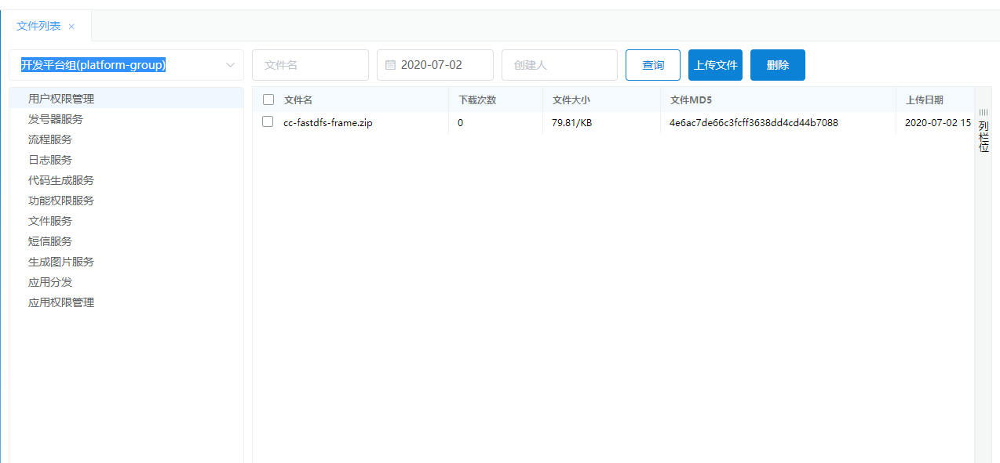

微服务系统使用向导
==================

组织架构管理
------------

#### 用户管理

用户管理中的，都有**IDM下发**，所以我们并不能修改删除用户。目前用户管理的作用主要配置用户的用户角色、功能角色和数据角色。但有一种特殊情况"**子账号**"，子账号是在微服务系统新建的，并且是唯一一种不走IDM验证就能登陆的账号类型。


1)  **用户角色、功能角色、数据角色、数据授权**

> 这四个功能都是授权用的，受数据权限的影响，不同租户权限只能看对应租户的权限。

2)  **复制权限**

> 其实这个功能也是授权用的，它的作用是把一个人某个租户的权限，全部复制到另外一个人身上。

3)  **IDM下发**

> 上面说明过，人员信息都是IDM下发过来的，但其实我们也能通过IDM的编码把人员最新信息下发微服务系统。

#### 部门管理

部门管理中的部门信息，是从MDM同步下来的，所以我们也不能修改删除。但是也有一种特殊情况，如果要使用**子账号**，就必须在微服务系统建一个本地存放子账号的部门。（非重点功能，了解作用即可）


#### 用户角色管理

用户角色，其实就是把多个功能角色或者多个数据角色组合成一个**新的**"用户角色"，比如财务管理系统有一个"会计角色"和"出纳角色"，而且财务经理需要看会计和出纳的所有功能权限，这时候我们只需要新建一个"财务经理"的用户角色，并把"会计角色"和"出纳角色"添加上去，那财务经理就能看对应功能。


#### 用户类型管理

这个功能就和标题一样，管理用户的类型，其实里面的类型是根据IDM下发过来的用户类型配置的，所以在日常使用也无需操作这个模块。（非重点功能，了解作用即可）


#### 数字字典管理

1)  数据字典中存放的是可以动态配置的常量参数，根据**类型(type)、编码(code)、名称(name)组合成一个唯一的动态参数**。

2)  通过数字字典我们可以动态修改下拉框选项、动态修改按钮名称等等功能。

3)  目前数字字典中常用的常量分别有下面几种：

| 类型               | 说明             | 实例                                                         |
| ------------------ | ---------------- | ------------------------------------------------------------ |
| RERESOURCE_TYPE    | 按钮常量         | 编码：02、名称：新增<br>编码：03、名称：修改<br/>编码：04、名称：删除 |
| DATA_RESOURCE_TYPE | 数据权限类型标识 | 编码：srm_company、<br/>名称：SRM公司                        |
| DATE_FORMAT        | 发号器日期格式   | 编码：yyyyMMdd、名称：年月日<br/>编码：yyMMdd、名称：年(2位)月日<br/>编码：yyyyMM、名称：年月<br/>编码：yyyy、名称：年 |
| SEG_TYPE           | 发号器分段类型   | 编码：0、名称：常量<br/>编码：1、名称：变量<br/>编码：2、名称：日期<br/>编码：3、名称：流水号 |
| PADDING            | 发号器补齐类型   | 编码：0、名称：不补齐<br/>编码：1、名称：右对齐/向左补齐<br/>编码：2、名称：左对齐/向右补齐 |
| RESET_DATE         | 发号器重置       | 编码：0、名称：不重置<br/>编码：1、名称：每天重置<br/>编码：2、名称：每月重置<br/>编码：3、名称：每年重置<br/>编码：4、名称：根据变量重置 |
| PC_OS_TYPE         | 操作系统类型     | 编码：3、名称：windows<br/>编码：4、名称：mac                |

功能权限管理
------------

#### 功能角色管理

介绍：功能角色管理主要的作用是授权功能菜单和配置角色人员，整个配置流程分为三步：建立功能角色-\>角色授权-\>角色添加人员。下面将以图文介绍。

1)  步骤一：在微服务系统中建立一个"日志查询角色"

> 

2)  步骤二：将日志管理下的菜单和按钮权限授权给这个"日志管理角色"

> 

3)  步骤三：配置"日志管理角色"的人员


4)  结果：完成配置后，角色对应的人员登陆微服务系统，就能看到日志管理模块。这里是写了一个例子，其他系统的功能角色配置请参照这些配置步骤即可完成。

#### 功能菜单管理

1)  介绍

> 功能菜单主要管理两种参数，第一种菜单目录参数，第二种按钮及其api接口的参数。其实菜单和按钮之间是以父子关系存在的，所以整个功能菜单看上去就是一个tree形状。


2)  作用

> 功能菜单的主要作用就是配置**按钮api接口**，这些api接口都来源自对应系统Controller文件。配置好按钮后api接口和功能角色后，功能角色中的对应人员才能调用到该api接口。


数据权限管理
------------

#### 功能思路讲解

怎么做到数据权限，我们的设计原理很简单，通过拦截器拦截sql语句并修改，做到控制能查询结果的控制。下图是我们整个数据鉴权流程的配置。


#### 数据角色管理

介绍：数据角色管理主要的作用是授权数据访问权限和配置角色人员，整个配置流程分为三步：建立数据角色-\>角色授权-\>角色添加人员。下面将以图文介绍。

1)  步骤一：在微服务系统中建立一个"A班数据角色"


2)  步骤二：将日志管理下的菜单和按钮权限授权给这个"A班数据角色"


3)  步骤三：配置"A班数据角色"的人员


4)  结果：完成配置后，角色对应的人员登陆微服务系统，在访问对应功能的数据权限就会受控，比如A班的人，只能看到A班人员的考勤。

#### 数据菜单管理

介绍：数据菜单管理的作用是同步对应数据源的数据到微服务平台中，同步完成以后才可以配置对应系统的数据权限，同步分为全量同步，增量同步，业务增量同步。

1)  全量同步数据

> 

| 参数     | 说明                                                         |
| -------- | ------------------------------------------------------------ |
| 数据源   | 获取数据源管理中的数据源选择项                               |
| 组名     | 数据字典中“DATA_RESOURCE_TYPE”类型的数据就是组名，没有相关组名先去数据字典中新建 |
| 表       | 根据数据源获取相关的数据库表                                 |
| 资源字段 | 根据表获取的字段，这个资源字段需要选表中的主键或唯一字段     |
| 默认字段 | 根据表获取的字段，这个取资源字段的描述，比如班别表资源字段为code=a，那么默认字段就取name=A班 |
| 条件     | 填写where条件进行筛选                                        |

2)  增量同步和业务增量同步数据

> 增量同步的概念就是更新数据，当同步的数据源对应的表数据有更新，就需要进行增量同步数据，如果不更新就无法配置新数据的权限。而增加同步和业务增量同步的区别在于，增量同步可以修改同步的条件，而业务增量同步不可以修改同步的条件。

#### 数据源管理

1)  介绍

> 数据源管理，是管理其他系统的数据源，为什么要有数据源管理，数据鉴权是通过修改sql进行鉴权，所以我们要把对应鉴权系统需要鉴权的数据过来，才能达到修改sql鉴权的目的。

2)  参数说明

| 参数       | 说明                                             |
| ---------- | ------------------------------------------------ |
| 数据源名称 | 数据源名称其实是数据库的名称，请别随便写         |
| 数据库类型 | 下拉选择框，目前只有mysql                        |
| 用户名     | 登陆数据库的账号                                 |
| 密码       | 登陆数据库的密码（明文）                         |
| 驱动名称   | 下拉框，目前只有mysql的驱动能选择                |
| 排序       | 列表中显示顺序                                   |
| 租户       | 下拉选择，请选择该系统对应的租户                 |
| url        | 连接数据库地址，这个和java中连接库的地址是一样的 |
| 备注       | 备注信息                                         |

> **配置完成后请点击"测试连接"按钮，确保填写内容无误。**

#### 数据鉴权代码示例

> 完成配置后，后端人员需要在对应接口加入AuthDataParam参数，并填写班别的数据鉴权标识，才能完成数据鉴权。其实数据鉴权的原理就是通过mybatis的sql拦截器，把sql拦截下来，并且在sql中添加where条件，以此达到数据鉴权的效果。

1)  AuthDataParam参数

| 参数     | 类型    | 说明                                                         |
| -------- | ------- | ------------------------------------------------------------ |
| uid      | 字符串  | 需要鉴权的用户ID，这个通常request的header里面就能获取        |
| dataType | 字符串  | 要获取的鉴权类型，数据鉴权写死DataType.USER_DATA_RESURCE.value()即可 |
| param    | HashMap | 配置需要鉴权的数据，数据字典中“DATA_RESOURCE_TYPE ”类型的数据是鉴权数据的类型 |

2)  代码示例

```java
AuthDataParam authParam = new AuthDataParam();
authParam.setDataType(DataType.USER_DATA_RESURCE.value());  //设置获取数据权限，这个地方写死即可
Map<String, Object> auth_params = new HashMap<String, Object>();
List<Long> codes = new ArrayList<>();
codes.add(38L);     //这里设置的code，是数据字典中type=DATA_RESOURCE_TYPE，对应数据的主键ID，比如班别对应的主键ID是38，那么这里就填38
auth_params.put("nodeTypes", codes);
authParam.setParams(auth_params);
authParam.setUid("59249");  //要鉴权的用户，这个由前端传过来

AuthMenu authMenu = new AuthMenu();
List<AuthMenu> authMenuList = getService().queryList(authParam,authMenu);   //查看用户59249，增加数据鉴权后能看到的菜单列表
```

系统管理
--------

#### 租户管理

1)  说明

> 在系统上，我们使用租户形式进行系统的管理，把相关模块的业务系统放在统一一个租户下管理。比如说我们为MES（智能制造系统）定义为一个租户，然后下面的相关的业务系统wm（派工管理系统）、qm（质量管理系统）、mm（物料管理系统）和dm（主数据管理系统），这四个系统都属于智能制造系统的模块，所以放在MES租户下。

2)  新建租户和绑定用户

> 新建租户只需要填写租户编码、租户名称即可。新建完租户后要绑定租户的用户，用户能查询租户下的所有系统。
>
> 

#### 服务管理

1)  说明

> 服务管理的"服务"就是租户下的对应业务系统，所以新建服务前需要有对应的租户，服务管理分为"服务端"和"客户端"管理，服务端就是后端，而客户端就是前端。服务端和客户端是多对多的关系。

2)  服务端

> 服务端是后端，那么服务端就是给客户端提供接口的，同步接口我们采用swagger中获取接口的api。
>
> 

3)  客户端

> 客户端是前端，客户端主要管理前端的菜单和对应按钮的权限，这里要和"功能菜单管理"配合用，在服务端配置好菜单和按钮后，绑定按钮的api要在功能菜单管理中配置。

| 参数         | 说明                                                         |
| ------------ | ------------------------------------------------------------ |
| 编码         | 编码在同一个服务端内必须唯一                                 |
| 名称         | 菜单和按钮的描述，前端页面获取权限时展示                     |
| 英文名称     | 非必填字段，主要是国际化时候用到                             |
| 排序         | 显示顺序                                                     |
| 绑定父级资源 | 菜单与菜单之间有父子关系，菜单与按钮之间也有父子关系，所以需要绑定这个关系 |
| 父级资源     | 下拉选择框，选择已经建好的父级菜单                           |
| 是否为资源   | 如果勾选，则为按钮。如果不选，则为菜单                       |
| 按钮类型     | 下拉选择框，按钮的类型，这里获取的是数据字典中类型为RERESOURCE_TYPE的数据，如果没所需类型可到数据字典中新增 |
| 备注         | 备注事项                                                     |


监控管理
--------

#### 服务监控

服务监控是监控后端消费者和生产者服务的存活数量，点击进去还看到每个节点的具体IP地址


#### 客户端监控

客户端监控主要有两个功能，第一个是查看在线人员，并且可以将在线人员踢下线。第二个是发送信息给在线的人员，而发送信息有两个方法，一种是**广播**，所有人员都会接收到，另一种是**p2p**，选择人员单独发送信息。


日志管理
--------

#### 操作监控

日志采集是使用elk技术+kafka做缓存层的，由于日志量过大，目前生产环境只保留一个月的日志数据，所以超一个月的数据是查询不到的。

1)  说明

> 操作监控是查看系统所有接口日志信息的功能，用户访问的每个接口我们都会采集，日志等级分为"正常"、"警告"、"错误"。用户不仅能通过日志等级查看日志，还可以通过请求时间、请求参数、请求地址、创建人和返回码作为条件查询日志。

2)  参数说明

| 参数           | 说明                                                         |
| -------------- | ------------------------------------------------------------ |
| traceId        | Zipkin上请求链路跟踪ID                                       |
| 请求时间       | 用户调用接口的时间                                           |
| 级别           | 分为info（正常），warn（警告），error（错误）                |
| 标题           | 请求接口的名称                                               |
| 持续时间（ms） | 接口从请求到返回的耗时                                       |
| 请求地址       | 请求接口的地址                                               |
| 请求状态       | 两个状态，状态200代表请求成功，状态500代表请求失败           |
| 请求方式       | 两个方式，get和post，get请求可能看不到参数                   |
| 创建人         | 请求接口的用户，有些创建人是-1，是因为有些接口没传创建人，如登陆接口。 |
| 请求参数       | 请求接口时候传的参数                                         |
| 备注           | 备注事项                                                     |
| 环境           | 系统环境，通常与你访问的系统环境一致                         |
| 操作           | 操作是日志查询跟踪链的，下面会说明                           |

3)  日志跟踪链

> 日志跟踪链通过一个跟踪ID，跟踪请求web、service、sql的请求顺序和耗时。
>
> 
> 
>点击mapper的sql跟踪，还能看到具体sql语句
> 
>{width="5.768055555555556in"
> height="3.5956878827646546in"}

#### Sql监控

Sql监控的目的是检查慢sql，如果有一些调用次数特别多，但查询很慢的sql，那这些sql就需要进行优化了。查询条件是请求时间，而且能查询排行前10、20、100、200的慢sql。

| 参数           | 说明                                              |
| -------------- | ------------------------------------------------- |
| 执行数         | 请求时间内sql执行的总次数                         |
| 执行时间（ms） | 请求时间内sql执行的总时间，总时间=平均时间*执行数 |
| 最慢（ms）     | 请求时间内执行最慢的sql                           |
| 平均时间（ms） | 请求时间内sql执行的平均耗时                       |
| 请求方法       | Mapper中sql方法的名称                             |
| 操作           | 查看该方法中具体每条sql的语句和耗时               |

查询页面：


详情页面：


#### 跟踪监控

跟踪监控和sql监控有点类似，sql是检查慢sql，而跟踪监控是检查慢接口。我们可以通过跟踪监控，检查到访问次数多而已执行慢的接口，然后针对该接口进行优化。

| 参数           | 说明                                                         |
| -------------- | ------------------------------------------------------------ |
| 执行数         | 请求时间内接口执行的总次数                                   |
| 执行时间（ms） | 请求时间内接口执行的总时间，总时间=平均时间*执行数           |
| 最慢（ms）     | 请求时间内执行最慢的接口                                     |
| 平均时间（ms） | 请求时间内接口执行的平均耗时                                 |
| 请求方法       | 请求的接口名称                                               |
| 操作           | 查看该方法中具体每个接口的参数和耗时，详情的页面其实和操作监控相同 |

查询页面：


详情页面：


#### 自定义日志监控

1)  介绍

在common-core包中，有一个LogUtil的类，这个类的作用就是自定义日志，功能和
log4j、slf4j类似，但LogUtil写的日志能采集到es中，并且在微服务系统有对应的监控模块，所以如果想用自定义日志的时候，请用LogUtil类。

2)  使用说明

自定日志可以通过请求时间、备注（模糊查询）、方法名、类名、级别进行查询，而查询的结果列表如下：

| 参数     | 说明                                          |
| -------- | --------------------------------------------- |
| 请求时间 | 用户调用接口的时间                            |
| 备注     | remark内填的内容，通常就是写错误原因          |
| 方法名   | 请求方法的名称                                |
| 类名     | 请求类的名称                                  |
| 请求结果 | 请求方法返回的结果                            |
| 级别     | 三个级别：info(正常)，warn(警告)，error(错误) |
| 请求参数 | 请求方法时候传递的参数                        |
| 环境     | 系统环境，通常与你访问的系统环境一致          |


3)  LogUtil类

| 名称       | 方法                                                         | 参数                                                         |
| ---------- | ------------------------------------------------------------ | ------------------------------------------------------------ |
| 自定义日志 | -customEvent<br/>-customEventInfo<br/>-customEventWarn<br/>-customEventError | 1.Level-等级：info,warn,error<br/>2.remark-备注<br/>3.classLastName-类名<br/>4.functionName-方法名<br/>5.parameters-参数<br/>6.result-返回结果<br/>7.spendTime-耗时 |
| 系统日志   | -sysEventInfo<br/>-sysEventWarnv<br/>-sysEventError          | 1.traceId-跟踪ID<br/>2.remark-备注<br/>3. clientHost-客户端IP<br/>4. method-方法名称<br/>5. requestUri-请求地址<br/>6. title-接口名称<br/>7. parameters-请求参数<br/>8. userAgent-代理用户<br/>9. status-状态：200，500<br/>10. createBy-接口请求者ID |
| SQL日志    | -sqlEventInfo<br/>-sqlEventWarn<br/>-sqlEventError           | 1.traceId-跟踪ID<br/>2.remark-备注<br/>3. clientHost-客户端IP<br/>4. method-方法名称<br/>5. requestUri-请求地址<br/>6. title-接口名称<br/>7. spendTime -耗时<br/>8.sql-执行的sql语句 |

文件管理
--------

#### 文件列表

文件列表是展示各个系统上传文件的记录，**但这个列表不提供对外的接口，所以各个系统文件记录都需要自己记录**。而这个模块的主要作用有三个：1.展示分片上传的功能。2.检查各个系统节点（**节点由运维组同事创建**）是否能上传文件。3.检查fastdfs是否正常。



#### 文件监控

这其实是一个监控页面，我们可以看到几样信息。节点中文件容量、节点中文件总数、每天文件上传的数量、上传文件的类型。


发号器管理
----------

发号器能生成分布式唯一码，配置共分两步。第一步需要配置唯一码的key和重置规则，第二步配置每个分段格式，下面具体学习如何配置一下唯一码

1)  第一步：配置唯一码规则

| 参数名称   | 格式                                                         | 说明                                                         |
| ---------- | ------------------------------------------------------------ | ------------------------------------------------------------ |
| 编码       | 字符串                                                       | 编码是一个唯一键，是获取唯一码的key值                        |
| 名称       | 字符串                                                       | 编码的中文名称，标识用                                       |
| 租户       | 下拉选择                                                     | 不同租户只能看到自己的租户的唯一码                           |
| 排序       | 数字                                                         | 在表中显示顺序                                               |
| 分隔符     | 字符串                                                       | 唯一码可能由多个分段组成，分隔符显示在字符串连接处。如A-0601-011 |
| 步长       | 数字（默认100）                                              | 当流水号等于最大序列号，就会将最大序列号+步长得到一个新的最大序列号 |
| 最大序列号 | 数字（默认100）                                              | 当前能获取的最大流水号，超过后会自动加上步长并且在数据库更新最大值 |
| 重置规则   | 下拉选择：<br>-不重置<br/>-每天重置<br/>-每月重置<br/>-每年重置<br/>-根据变量重置 | 重置是重置流水号，重置的流程将从1开始                        |

2)  第二步：配置分段格式

| 参数       | 格式                                                         | 说明                                                         |
| ---------- | ------------------------------------------------------------ | ------------------------------------------------------------ |
| 分段排序   | 数字（大于0的整数）                                          | 分段显示的顺序：1-2-3                                        |
| 分段类型   | 下拉框：-常量-变量-日期-流水号                               | 分段类型共分为4种：常量：字符串格式，在唯一码中固定不变变量：根据传入的参数替换到唯一码中日期：唯一码中显示的日期流水号：一个自增值，根据重置规则重置 |
| 分片当前值 | 字符串或下拉选择框                                           | 分片当前值共分为4种：<br/>1. 当类型为常量则值为字符串<br/>2. 当类型为变量则值为字符串<br/>3. 当类型为日期则为下拉选择框<br/>-年(2位)月日<br/>-年月日<br/>-年月<br/>-年<br/>4. 当类型为流水号则值为数字 |
| 流水号位数 | 数字                                                         | 设置流程号的长度，如果补齐字段为0，流水号位数为4，生成的流水号可以根据补齐方式分别生成1，0001，1000三种格式的号码 |
| 补齐方式   | 下拉框：<br/>-不补齐<br/>-右对齐/向左补齐<br/>-左对齐/向右补齐 | 根据补齐方式可以生成不同格式流程号，如果补齐字段为0，流水号位数为4。不补齐生成1 ，左补齐生成0001，右补齐生成1000 |