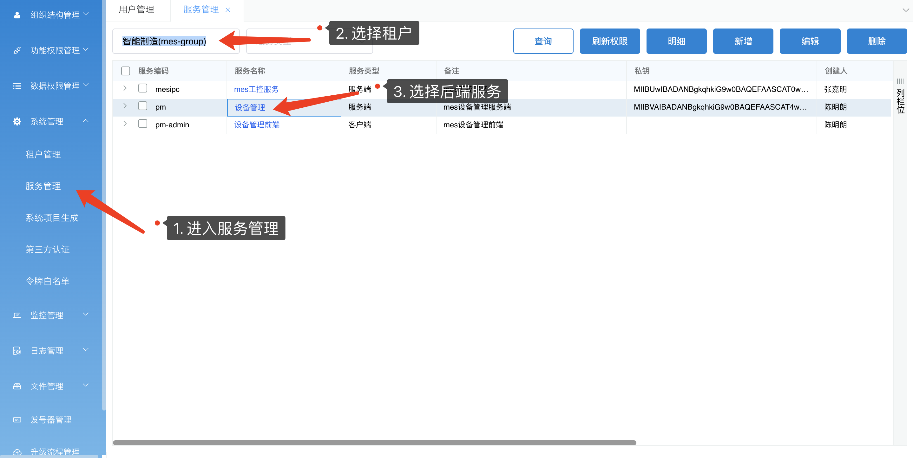

# 微服务1.0升级2.0指南


这里升级我们以mes中的pm项目为例，因为mes是由多个子系统组成的客户端，所以新建服务时，我们只需要创建一个客户端服务即可，服务端则需要根据模块来创建。


## 创建服务

进入微服务平台2.0，对需要升级的项目创建服务端和客户端。如果租户还没创建的就需要先创建租户，升级系统前先找到系统对应的租户。


新增服务端：


客户端：

客户端除了新系统，旧系统的数据已经迁移到数据库中，需要到数据库中的`auth_client`表中找到对应记录，在`auth_tenant_id`和`auth_tenant_code`字段中加上相应的租户id和租户编码，就完成客户端绑定。


## 依赖包升级

**重要：原本使用的com.lesso.common包弃用，改用common-\*\*包，这些包已经将原本的common包功能拆开，避免了造成引入不需要的包造成项目依赖过于臃肿的问题。以下为必引依赖，其他依赖请根据项目实际情况饮用。**

各个common包的功能，可以前往[联塑IT开发文档](http://itdoc.lesso.com/)进行查阅。


1. 主服务将父级依赖改成`lesso-springboot-dubbo-base`包

> dubbo-base包里面已经囊括了所有的common-\*\*包，引用common-\*\*包就不用指定common包的版本号了，只需要更新base包的版本号即可

``` xml
<parent>
  <artifactId>lesso-springboot-dubbo-base</artifactId>
  <groupId>com.lesso</groupId>
  <version>1.0.8</version>
</parent>
```

***

2. 主服务引入依赖

```xml
<dependency>
	<groupId>com.lesso</groupId>
  <artifactId>common-core</artifactId>
</dependency>
<dependency>
  <groupId>com.lesso</groupId>
  <artifactId>common-zipkin</artifactId>
</dependency>
<dependency>
  <groupId>com.lesso</groupId>
  <artifactId>common-redis-core</artifactId>
</dependency>
<dependency>
  <groupId>com.lesso</groupId>
  <artifactId>common-redis-client</artifactId>
</dependency>
<dependency>
  <groupId>com.lesso</groupId>
  <artifactId>authority-facade</artifactId>
</dependency>
<dependency>
  <groupId>com.lesso</groupId>
  <artifactId>auth-function-facade</artifactId>
</dependency>
```

***

3. web模块引入依赖

```xml
<dependency>
  <groupId>com.lesso</groupId>
  <artifactId>common-context-consumer</artifactId>
</dependency>
<dependency>
  <groupId>com.lesso</groupId>
  <artifactId>common-auth</artifactId>
</dependency>
```

***

4. service模块引入依赖

```xml
<dependency>
  <groupId>com.lesso</groupId>
  <artifactId>common-database</artifactId>
</dependency>
<dependency>
  <groupId>com.lesso</groupId>
  <artifactId>common-context-provider</artifactId>
</dependency>
```


至此common包升级完成，其他common包请各自按需求引入。


***


## 增加配置

> 这里以mes里面的的pm系统作为示例；
>
> 配置增加按照dev test uat和prod都增加一份v2的配置，在1.0的配置基础上修改即可。
>
> 修改完成后推送代码到新的分支。
>
> 租户的创建和系统的创建请联系平台组同事。


1. 添加租户和系统编码配置

```properties
lesso.app.tenant.code=mes-group		#租户编码
lesso.app.code=pm		#系统编码
```

2. 配置服务发现redis地址及私钥

> 私钥在创建系统时获取

```properties
#开发环境
redis.auth.host=172.16.100.222
redis.auth.port=6379
redis.auth.password=dI0V85mGpM9+p+h0M2zaTM==
redis.auth.switch=true
#测试环境
redis.auth.host=172.16.100.221
redis.auth.port=6379
redis.auth.password=dI0V85mGpM9+p+h0M2zaTM==
redis.auth.switch=true

#私钥
lesso.redis.privateKey=........
```


3. 将权限系统的RPC配置版本号改成0.2.0

```properties
rpc.auth.group=dev-auth
rpc.auth.version=0.2.0
rpc.auth.check=false
```


4. 注释无用的配置

```properties
app.jwt.name=...
elk.kafka.topic=...
elk.app.name=...
app.name=...
```


5. 启动项目，检查项目运行情况

见到服务注册信息，证明项目升级成功。


6. 修改ci，增加job在新分支上面打包tag为v2的镜像用于后续测试


***
***
***


## 导入功能菜单

> 从1.0导入功能菜单到2.0，需要先在数据库`auth_resource`表中导出1.0的系统资源，修改部分字段值，导入到2.0。


### 导入菜单


#### 导出1.0系统系统资源：

在权限平台数据库执行如下SQL语句，获得系统资源：

>  `#{system_id}`是你需要导入系统的**系统id**，这个值可以自行查出，因为pm隶属于mes系统，与其他子系统组成一个mes客户端，所以这种情况需要导出整个mes的功能菜单，即是填写mes的系统id，45。

```sql
SELECT
	r.id,
	r.parent_id,
	r.state,
	r.unable,
	r.remark,
	r.create_by,
	r.create_time,
	r.update_by,
	r.update_time,
	r.sort,
	r.`code`,
	r.`name`,
	r.resource_type AS menu_type,
	r.resource_tree AS menu_tree,
	r.en_name,
	dic.`code` AS button_type 
FROM
	auth_resource r
	LEFT JOIN auth_dic dic ON r.type = dic.id 
WHERE
	r.system_id = #{system_id}
	AND r.state = 1 
	AND r.unable = 1
ORDER BY
	r.parent_id
```


#### 对数据进行处理

1. 查询结果导出后加入两个字段`auth_client_id`和`auth_client_code`，分别填入客户端的id和编码。
2. 将**最上级菜单的`parent_id`**的值设为0，`menu_tree`的值设置为空


至此处理好对应`auth_menu`表的数据，直接导入到`auth_menu`表中，注意导入时是否有重复的id，如果有重复id要先处理原来的脏数据。


### 导入数据资源

在上一步导入功能菜单的数据基础上，增加一个字段`auth_menu_id`，这个字段的值要和id一样，保留`state`和`unable`字段，新增`is_auth`字段，这三个字段的值都默认为1:


将这些数据导入到`auth_resources`表中。


***


至此功能菜单导入完成，可以在权限平台2.0中查看导入结果是否正确。


检查功能菜单无误即导入成功。


### 绑定功能角色

目前数据库中导入的功能角色只绑定了客户端编码，没有绑定租户编码，所以需要将功能角色绑定租户。以MES为例：

```sql
UPDATE 
	auth_client c,
	auth_roles r 
SET 
	r.tenant_id = c.auth_tenant_id 
WHERE
	c.`code` = r.client_code 
	AND r.client_code = 'mes-admin'
```


***

***

***


## 导入服务端api




导入结果：


***
***
***

## 第三方代理认证服务接口文档

### 第三方代理认证权限1.0和2.0接口


#### 第三方认证白名单配置

登录权限平台，添加白名单


#### 使用说明

> 请求方式：**任意请求方式（GTE,POST,PUT,DELETE） http://ip:端口/proxy/{sysCode}/xxx**


请求参数如下：

|   名称   | paramType |     说明     |  类型  | 是否必填 |                     备注                      |
| :------: | :-------: | :----------: | :----: | :------: | :-------------------------------------------: |
| userName |  Header   |   员工工号   | String |    是    |                      是                       |
| sysCode  |  Header   |   系统编码   | String |    是    |                      是                       |
|  token   |  Header   | 用户信息令牌 | String |    是    | **使用权限2.0的系统需要传,权限1.0不需要传！** |


响应结果：

| **名称**  | **paramType** | **说明** | **类型** |                  **备注**                  |
| :-------: | :-----------: | :------: | :------: | :----------------------------------------: |
| tempToken |    Header     | 临时票据 |  String  | **临时票据，授权通过时，拿着票据访问接口** |


请求示例：

*权限1.0*

> 请求参数：


> 响应结果：


*权限2.0*

> 请求参数


当第三方代理授权通过的时候响应头中会有一个 `tempToken `的参数（临时票据）当调继续调用其他的第三方相关接口的时候把`tempToken`（临时票据）放入请求头中即可**


> 具体示例


***


### 白名单认证生成jwt令牌接口


#### 配置服务认证白名单


#### 使用说明

*权限1.0：*

> 请求方式：**GET请求(权限1.0)**
>
> http://ip:端口/jwt/getJwt/{sysCode}/{username}或
>
> http://ip:端口/jwt/getJwt/{sysCode}/{username}/{device}


示例：


*权限2.0：*

> 请求方式：**GET请求（权限2.0）**
>
> http://ip:端口/jwt/getJwt/{token}


示例：


> 请求参数：

| **名称** | **paramType** |   **说明**   | **类型** | **是否必传** |                       **备注**                       |
| :------: | :-----------: | :----------: | :------: | :----------: | :--------------------------------------------------: |
| username |     path      |   员工工号   |  String  |     必传     |                       员工工号                       |
| sysCode  |     path      |   系统编码   |  String  |    不必传    | **系统编码，使用权限1.0的时候为必传，2.0不需要传！** |
|  token   |     Query     | 用户信息令牌 |  String  |    不必传    |    **使用权限2.0的系统需要传,权限1.0不需要传！**     |


> 响应结果：

```json
{
    "code": 1,
    "info": "查询成功",
    "timestamp": 1591086695398,
    "total": 1,
    "rows": {
        "authorization": "eyJhbGciOiJIUzUxMiIsInppcCI6IkRFRiJ9.eNo8j2FqwzAMhe-i38mwU9uRc4NeYL8MRYmVNVtTl9guhdK71w7bEAje994T6AnfaYEBlBDCKIWtIqzLTy16jS3NI0mc2JNW0EDMYwlba9HavuglxqJT-OFrG3m781YhJRiktlKgMdg1wI_bH-i7CrZw4VqknM6nKk7k1-VauucQSxlk13-IMrKg_fonXTIX4-lgCp4dDA7C6qBxkP5B9Gv7tYV827nn-zLx0e8WjUoY1EZ3s0bZo1SzONCBxciW9Kj2Rl5q-Pe7F7zeAAAA__8.aieHyIKixi7KRxo6omboYcSK5esPB9Nijkb22Altf4uZ7Fy-PL0JTftCSF0jsLCayAF3JkH72URi2EXWU6ZBsw",
        "uid": "9998997",
        "token": "g/Mj0Sb6IXu7hD6XpfGAbQ=="
    }
}
```


### 如何使用重写第三方认证拦截器的isPass() 方法

1. 加入依赖：

```xml
<dependency>
  <groupId>com.lesso</groupId>
  <artifactId>lesso-third-proxy-client</artifactId>
</dependency>
```


2. 使用示例：


isPass()方法的作用是可以根据引入应用的具体业务进行添加自己的一些业务逻辑

在这之前一定要把重写的实例注入到spring ioc容器中！！！！！不然重写的逻辑不会生效